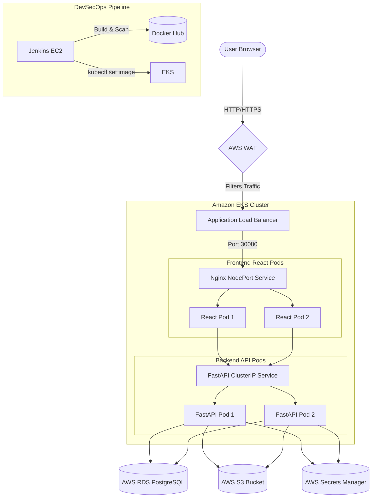

# AssembleMonitor — Cloud-Native Construction Site Management System


## 🎯 Product Overview

AssembleMonitor is a cloud-native construction site management platform designed to provide high-availability, scalable, and secure operations for enterprise construction teams. The platform ensures zero-downtime rollouts and resilient state management by leveraging a distributed microservices architecture deployed natively on Kubernetes.

## ⚙️ DevOps Implementation

This project was built from the ground up with a focus on automation, scalability, and observability, implementing the following core DevOps practices:

- **Cloud Infrastructure**: Architected a distributed microservices environment across optimized AWS EC2 compute nodes (`c7i-flex.large`), utilizing Auto Scaling Groups (ASG) and Application Load Balancers (ALB) for high availability.
- **Security & Secrets**: Protected by an AWS Web Application Firewall (WAF) to mitigate common exploits. Secrets are securely managed via AWS Secrets Manager.
- **Database Decoupling**: Integrated a highly available AWS RDS PostgreSQL instance to decouple database state and ensure reliable data persistence.
- **Storage**: Implemented AWS S3 for secure, scalable object storage (e.g., site photos).
- **Continuous Integration / Continuous Deployment (CI/CD)**: Engineered an automated pipeline using a dedicated Jenkins build server. The pipeline automatically orchestrates zero-downtime rolling updates to the Kubernetes cluster.
- **DevSecOps**: Enforced static code analysis (SonarQube) with strict, blocking Quality Gates, and container vulnerability scanning (Trivy) in the CI pipeline to prevent insecure deployments.
- **Configuration Management**: Automated the provisioning and configuration of dedicated servers using Ansible playbooks for reproducible, idempotent setups.
- **Infrastructure as Code (IaC)**: Provisioned all AWS infrastructure (VPC, EC2, ASG, ALB, WAF, RDS, S3, Secrets Manager, CloudWatch) using Terraform.
- **Container Orchestration**: Orchestrated the full-stack application natively on a highly available Amazon EKS (Elastic Kubernetes Service) cluster, leveraging Deployments, NodePort Services, ConfigMaps, Secrets, Liveness/Readiness probes, and Horizontal Pod Autoscalers (HPA).
- **Observability**: Deployed Kubernetes Metrics Server for auto-scaling, alongside AWS CloudWatch for centralized logging and infrastructure alarms.

## ✨ Features

- **Role-Based Access Control (RBAC)**: Secure, distinct dashboards for Admins, Project Managers, Site Engineers, and Clients.
- **Phase & Task Management**: Break down construction projects into trackable phases and executable tasks.
- **Material Management**: Monitor inventory deliveries, stock levels, and daily resource consumption.
- **Site Photos**: Direct, secure upload of construction progress photos to AWS S3.
- **Attendance & Expenses**: Track engineer working hours and log non-material project expenses.

## 💻 Application Tech Stack

- **Frontend**: React, Vite, HTML, CSS, Vanilla JavaScript
- **Backend API**: Python FastAPI, SQLAlchemy, Alembic (Migrations)
- **Database**: PostgreSQL (AWS RDS)
- **Storage**: AWS S3
- **Authentication**: JWT (JSON Web Tokens)
- **Web Server**: Nginx (Running inside the frontend Pod)

## 🛠️ DevOps Tech Stack & Justification

Modern DevOps requires understanding *why* a tool was chosen, not just how to use it.

| Category | Tool | Justification (The "Why") |
|---|---|---|
| **Containerization** | Docker | Ensures absolute environment parity between local dev and production EKS. |
| **Cloud Provider** | AWS | Industry leader; utilized specialized components (WAF, Secrets Manager) for enterprise security. |
| **CI/CD Automation** | Jenkins | Provides a highly-customizable, stateful execution environment for complex deployment pipelines. |
| **DevSecOps** | SonarQube, Trivy | Implements "Shift-Left" security, preventing vulnerable images from ever reaching the registry. |
| **Infrastructure as Code** | Terraform | Provides declarative, reproducible, and version-controlled infrastructure scaling. |
| **Orchestration** | Amazon EKS | Managed control plane reduces operational overhead while providing native HPA and auto-healing. |
| **Observability** | Prometheus/Grafana | Industry-standard metric aggregation providing real-time visibility into pod CPU/Memory and API latency. |
| **Performance Testing**| k6 | Scriptable load testing to actively validate the HPA scaling policies under stress. |

## 🏗️ Architecture

The production-style cloud architecture is distributed across multiple AWS EC2 `c7i-flex.large` instances to separate concerns, isolate workloads, and maximize security.



## 🐳 Local Development Environment

For rapid local testing and development, the application utilizes a streamlined Docker Compose environment:

```bash
docker compose up --build -d
docker compose exec api alembic upgrade head
```

- **Frontend**: `http://localhost:3000`
- **Backend API Docs**: `http://localhost:8000/docs`
- **Adminer DB UI**: `http://localhost:8080`

## 🚀 Deployment Architectures (Evolution)

This project evolved through multiple deployment architectures, demonstrating progressive mastery of Cloud and DevOps engineering. Each strategy is fully documented in the `docs/deployments/` directory.

| Architecture | Best For | Tech Stack | Complexity | Documentation |
|---|---|---|---|---|
| **Local Docker** | Rapid Prototyping / Development | Docker Compose | Low | [View Guide](docs/deployments/01-LOCAL-DOCKER.md) |
| **Manual EC2 (Legacy)** | Staging / Pre-Kubernetes | Docker, AWS EC2, ASG, ALB | Medium | [View Guide](docs/deployments/02-MANUAL-EC2.md) |
| **K3s Cluster** | Standalone Orchestration | Kubernetes (K3s), Jenkins | High | [View Guide](docs/deployments/03-K3S-CLUSTER.md) |
| **Amazon EKS (Prod)** | Enterprise Production | EKS, ALB, AWS WAF, HPA | Very High | [View Guide](docs/deployments/04-AWS-EKS-PROD.md) |

### Enterprise Production Infrastructure (Amazon EKS)
The primary, active production architecture utilizes a distributed, cloud-native AWS deployment strategy:
- **Amazon EKS**: A highly available managed Kubernetes control plane with a managed Node Group (EC2 `c7i-flex.large`) running the Frontend and Backend pods. Protected by an AWS WAF and exposed securely via an Application Load Balancer (ALB) attached directly to the EKS NodePorts.
- **Horizontal Pod Autoscaler (HPA)**: Dynamically scales the frontend and backend pods between 2 to 5 replicas based on CPU utilization provided by the Kubernetes Metrics Server.
- **Jenkins Server**: A dedicated EC2 node for CI/CD pipeline execution, Trivy vulnerability scanning, and container building.
- **RDS**: Managed PostgreSQL ensuring automated backups, high availability, and decoupled state management in private subnets.
- **S3**: Secure file storage for construction site photos.
- **Secrets Manager & CloudWatch**: Secure injection of database/JWT credentials to the EKS pods and centralized metrics/alarms.

## 🔄 DevSecOps CI/CD Pipeline

A dedicated Jenkins server powers the automated CI/CD lifecycle. The pipeline (`Jenkinsfile-k3s`) executes:
1. **Source Code Checkout** from GitHub.
2. **SonarQube Static Analysis** and strict Quality Gate enforcement (pipeline aborts if code is insecure).
3. **Docker Image Build** for the frontend and backend.
4. **Trivy Container Scan** to detect HIGH and CRITICAL vulnerabilities in the built images.
5. **Docker Hub Push** to the centralized image registry.
6. **Kubernetes Rollout** to the EKS cluster via zero-downtime dynamic image tagging over the private AWS network.

## ☁️ Infrastructure as Code (Terraform)

Terraform is actively utilized to codify and automate the provisioning of the entire AWS environment, including:
- Custom VPC, Public/Private Subnets, and NAT Gateway
- Auto Scaling Groups (ASG) and Launch Templates using dynamic `user_data`
- Application Load Balancers (ALB) and Web Application Firewalls (WAF)
- Stateful and stateless EC2 instances (Jenkins, SonarQube, K3s, Monitoring)
- Strict Security Group rules
- The RDS PostgreSQL database
- The S3 Bucket
- AWS Secrets Manager and IAM Instance Profiles
- CloudWatch Log Groups and Metric Alarms

## ☸️ Kubernetes (Amazon EKS)

The application is natively orchestrated via Amazon EKS. Manifests provided in the `k8s/eks-advanced/` directory leverage advanced enterprise orchestration features:
- **Deployments & Services**: Managing the lifecycle of the FastAPI and React pods. The frontend is exposed via a robust NodePort service directly bound to an external AWS Application Load Balancer.
- **Auto-Scaling (HPA)**: Kubernetes Metrics Server feeds real-time CPU data to the Horizontal Pod Autoscaler, enabling the application to seamlessly absorb traffic spikes.
- **Self-Healing**: Configured `livenessProbe` and `readinessProbe` to automatically restart unhealthy containers and drop them from the ALB traffic pool.
- **Dynamic Configuration**: Nginx proxy configuration injected dynamically at runtime via `ConfigMaps` to ensure flawless backend routing without hardcoded images.
- **Secrets Injection**: Decoupled environment variables injected via Kubernetes `Secrets`.

## 📊 Monitoring and Operations

- **Prometheus**: Aggregates time-series metrics from both the application and the underlying infrastructure.
- **Grafana**: Provides centralized visual dashboards for real-time alerting and deep system introspection.
- **Node Exporter**: Exposes deep hardware and OS-level metrics.
- *Configuration files (`prometheus.yml`, `grafana.ini`, `systemd` services) are version-controlled in the `monitoring/` directory following Configuration as Code best practices.*

## 🔒 Security and FinOps

> [!IMPORTANT]  
> **Security:** Enforced through DevSecOps vulnerability scanning, least-privilege IAM roles, private RDS network isolation, strictly scoped EC2 security groups, secure Jenkins credential injection, and S3 Block Public Access.

> [!TIP]
> **FinOps & Cost Management:** Actively optimized by suspending idle environments via Terraform and auto-scaling efficiently with HPA and Cluster Autoscaler.

## 🧠 Lessons Learned & Architectural Trade-offs

A critical part of engineering is understanding trade-offs. Throughout this project, several key decisions were made:

- **EKS vs. K3s EC2**: Initially deployed on a single K3s EC2 instance to minimize AWS costs. However, as load testing (k6) revealed bottlenecks, the architecture was migrated to Amazon EKS. **Trade-off**: EKS incurs a higher baseline cost ($73/month control plane) but drastically reduces operational maintenance and provides superior Auto-Scaling (HPA).
- **Jenkins EC2 vs. GitHub Actions**: Opted for a self-hosted Jenkins EC2 instance rather than managed GitHub Actions. **Trade-off**: Requires manual patching and security group management, but enables strict, private network control over build server administration and agent configuration.
- **ALB NodePort vs. Ingress Controller**: Bypassed deploying an NGINX Ingress Controller inside EKS in favor of routing an external AWS ALB directly to Kubernetes NodePorts. **Trade-off**: Reduces in-cluster complexity and leverages native AWS WAF protection, though it couples the infrastructure heavily to Terraform rather than native Kubernetes YAML.

## 📸 Screenshots

Below is a highlight of the infrastructure and application. For the complete, comprehensive gallery covering all aspects (AWS, CI/CD, Kubernetes, Monitoring, Security), please refer to the full [System Screenshots](docs/SCREENSHOTS.md) and the `docs/screenshots/` directory.

### Architecture
*(Add your architecture diagram here: `docs/screenshots/01-architecture-diagram.png`)*

### Application
*(Add your landing page or dashboard here: `docs/screenshots/02-landing-page.png`)*

### AWS Infrastructure
*(Add your EC2 instances or ALB screenshot here: `docs/screenshots/14-ec2-instances.png`)*

### CI/CD
*(Add your Jenkins pipeline success here: `docs/screenshots/27-jenkins-pipeline-success.png`)*

### Kubernetes
*(Add your cluster overview or pods here: `docs/screenshots/30-kubectl-get-pods.png`)*

### Monitoring
*(Add your Grafana dashboard here: `docs/screenshots/34-grafana-dashboard.png`)*

## 📚 Documentation

Extensive operational runbooks and architectural documentation can be found in the `docs/` folder:
- [Architecture Design Details](docs/ARCHITECTURE.md)
- [CI/CD Pipeline Flows](docs/CI_CD_PIPELINE.md)
- [Step-by-Step Deployment Guides](docs/DEPLOYMENT_GUIDE.md)
- [Infrastructure as Code (Terraform)](docs/INFRASTRUCTURE.md)
- [Security Posture](docs/SECURITY.md)
- [Operational Runbook & Disaster Recovery](docs/OPERATIONAL_RUNBOOK.md)


