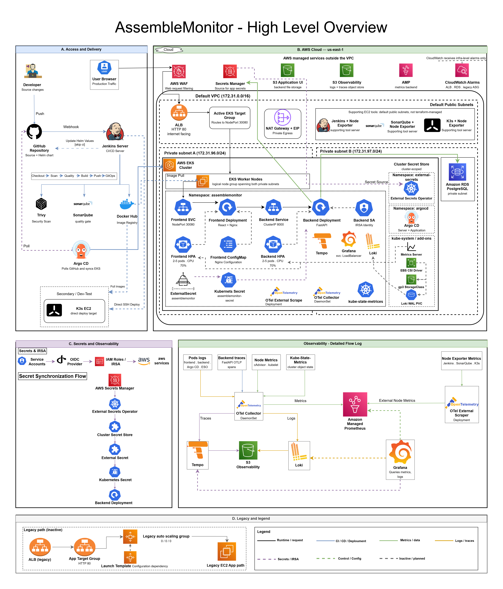
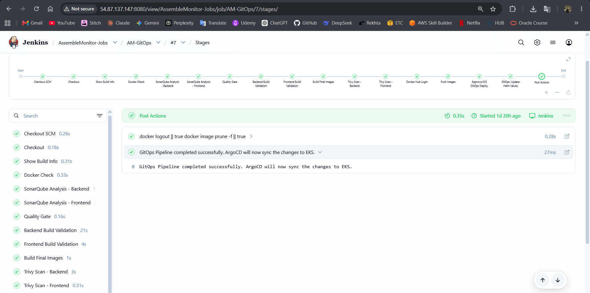
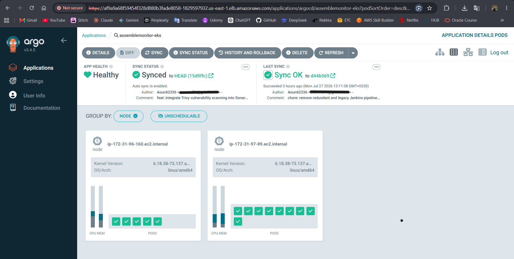
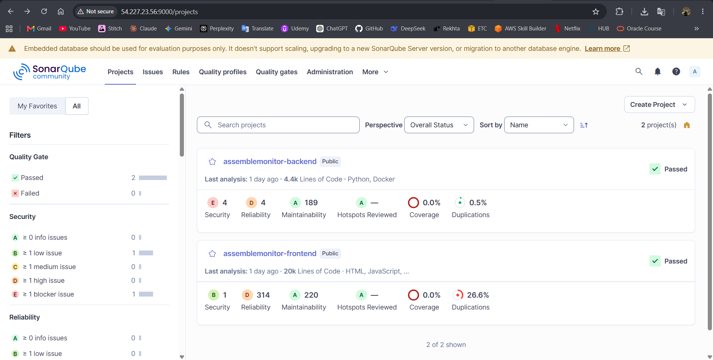
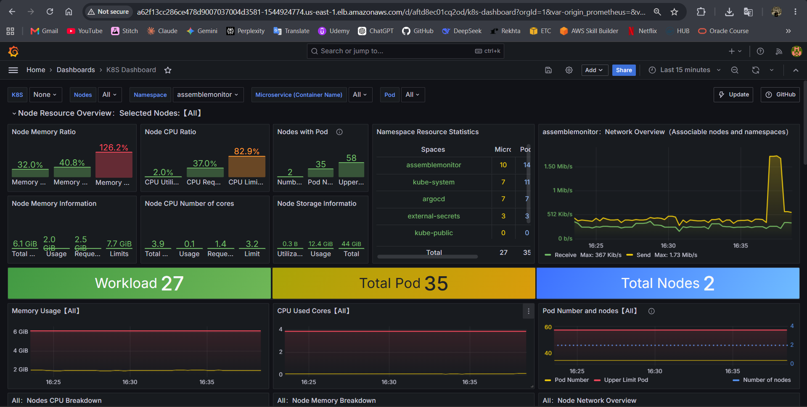
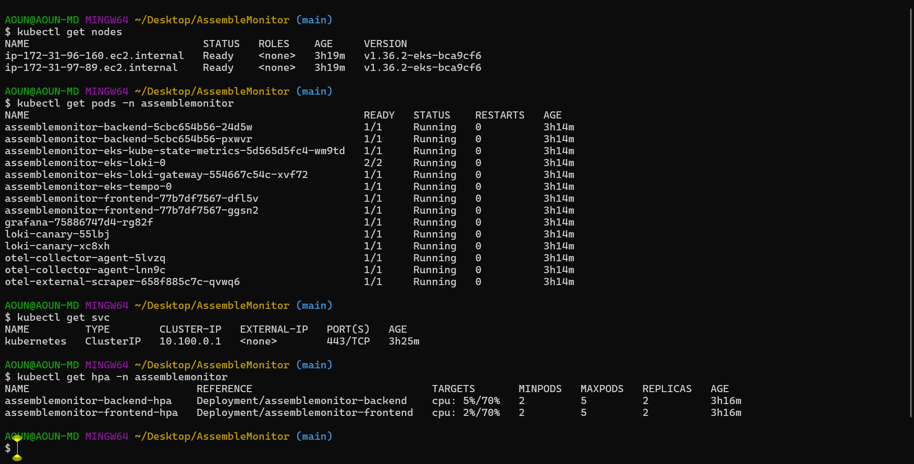
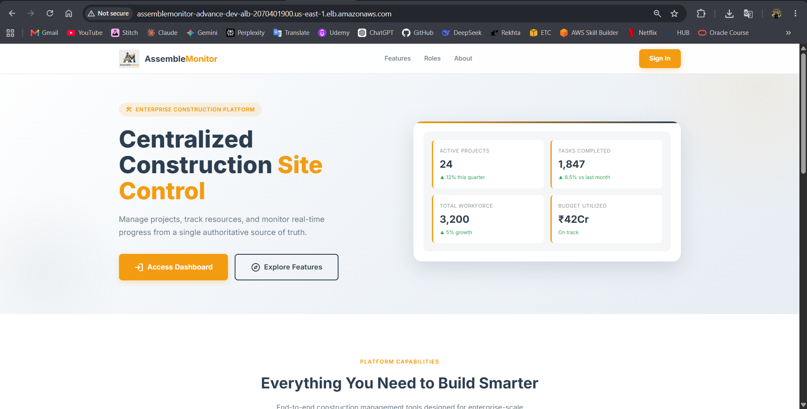

# AssembleMonitor — Cloud-Native Construction Management Platform

<!-- Infrastructure & Cloud -->

[](https://aws.amazon.com/)
[](https://kubernetes.io/)
[](https://www.terraform.io/)
[](https://www.docker.com/)

<!-- CI/CD & DevSecOps -->

[](https://www.jenkins.io/)
[](https://argo-cd.readthedocs.io/)

<!-- Observability -->

[](https://opentelemetry.io/)
[](https://prometheus.io/)
[](https://grafana.com/)

<!-- Application Stack -->

[](https://fastapi.tiangolo.com/)

---

AssembleMonitor is a cloud-native construction site management platform deployed end-to-end on AWS EKS — Terraform-provisioned infrastructure, a Jenkins GitOps CI/CD pipeline, External Secrets Operator for secret management, and a full OpenTelemetry observability stack covering metrics, logs, and traces. It demonstrates end-to-end infrastructure automation, security-by-design, and operational observability across the full DevOps lifecycle.

The platform serves four RBAC roles across two complete, independently documented deployment paths: a **GitOps EKS pipeline** (primary) and a **K3s Jenkins pipeline** (staging/lightweight).

---

## ⚡ Project Highlights

|                       |                                                                                              |
| --------------------- | -------------------------------------------------------------------------------------------- |
| 🏗️ **Infrastructure** | EKS v1.36 · 2-node cluster (`c7i-flex.large`) · HPA 2→5 pods · ALB + WAFv2                   |
| 🔐 **Security**       | IMDSv2 enforced · IRSA per service account (6 roles) · ESO (no secrets in Git) · WAF rate-limit 2000 req/IP |
| 📊 **Observability**  | Full OTel pipeline: metrics → AMP, logs → Loki, traces → Tempo, all in Grafana               |
| 🔄 **GitOps**         | Jenkins → GitHub → ArgoCD → EKS · Zero `kubectl` in CI · ArgoCD self-heals drift             |
| 🛡️ **DevSecOps**      | SonarQube quality gates + Trivy CVE scanning on every build (shift-left)                     |
| 💰 **FinOps**         | Ephemeral cluster: `terraform destroy` nightly, `terraform apply` to restore (observed ~8–10 min in testing)  |

## Architecture



> The full system in one view: Jenkins GitOps CI/CD pipeline, AWS WAF-protected ALB routing into Amazon EKS across private subnets, IRSA-secured workloads, External Secrets Operator syncing from AWS Secrets Manager, and a complete OpenTelemetry observability pipeline — logs to Grafana Loki, traces to Grafana Tempo, metrics to Amazon Managed Prometheus, all visualised in Grafana.

→ [View full 9-diagram architecture documentation](docs/architecture/ARCHITECTURE.md)

---

## Tech Stack

### Application

| Layer          | Technology                                                                |
| -------------- | ------------------------------------------------------------------------- |
| **Frontend**   | React 18 · Vite 5 · React Router v6 · HTML/CSS · Vanilla JS               |
| **Backend**    | Python FastAPI SQLAlchemy (async), Alembic                                |
| **Database**   | PostgreSQL 16 (AWS RDS)                                                   |
| **Storage**    | AWS S3 (site photo uploads, versioned)                                    |
| **Auth**       | JWT — python-jose + passlib/bcrypt, access + refresh tokens               |
| **Web Server** | Nginx (serves the React build inside the frontend container)              |

### DevOps

| Category          | Tool                                | Why                                                                                |
| ----------------- | ----------------------------------- | ---------------------------------------------------------------------------------- |
| **Cloud**         | AWS                                 | Utilized WAF, Secrets Manager, RDS, EKS, AMP — purpose-built managed services      |
| **IaC**           | Terraform                           | Declarative, version-controlled infrastructure; full environment reproducibility   |
| **Containers**    | Docker                              | Guaranteed environment parity between local and production EKS                     |
| **Orchestration** | Amazon EKS                          | Managed control plane, native HPA, IRSA, EBS CSI — reduces operational overhead    |
| **CI**            | Jenkins (self-hosted EC2)           | Private network control, SonarQube integration, stateful build history             |
| **CD**            | ArgoCD (GitOps)                     | Git as single source of truth; zero Jenkins cluster credentials; drift detection   |
| **Manifests**     | Helm                                | DRY templating for multi-component, environment-parameterized Kubernetes manifests |
| **DevSecOps**     | SonarQube + Trivy                   | Shift-Left: quality gates and CVE scanning before any image reaches the registry   |
| **Config Mgmt**   | Ansible                             | Idempotent, reproducible OS-level provisioning for Jenkins, K3s, SonarQube servers |
| **Secrets**       | External Secrets Operator           | No base64 Kubernetes secrets in Git; synced live from AWS Secrets Manager          |
| **Observability** | OTEL + AMP + Loki + Tempo + Grafana | Full metrics, logs, and traces pipeline with pre-provisioned dashboards            |

---

## Application Features

The platform provides distinct dashboards for each RBAC role:

| Role                | Capabilities                                                          |
| ------------------- | --------------------------------------------------------------------- |
| **Admin**           | Full system access — user management, analytics, all project data     |
| **Project Manager** | Project and phase planning, task assignment, budget tracking          |
| **Site Engineer**   | Attendance logging, task updates, material consumption, photo uploads |
| **Client**          | Read-only visibility into project progress and status                 |

Site photos are stored securely in AWS S3 using IRSA Web Identity Tokens — no credentials embedded in the application.

---

## Deployment Paths

This project supports two distinct, fully automated deployment architectures. Each has its own Jenkins pipeline and is independently documented.

|                      | **Path 1 — EKS GitOps (Primary)**               | **Path 2 — K3s Pipeline**          |
| -------------------- | ----------------------------------------------- | ---------------------------------- |
| **Orchestration**    | Amazon EKS (managed control plane)              | K3s on AWS EC2                     |
| **CD Mechanism**     | ArgoCD (GitOps — syncs from GitHub)             | Jenkins direct `kubectl apply`     |
| **Manifest Format**  | Helm chart (`k8s/helm-chart/`)                  | Raw Kubernetes YAML (`k8s/*.yaml`) |
| **Secrets**          | External Secrets Operator → AWS Secrets Manager | Kubernetes `Secret` (base64)       |
| **Auto-Scaling**     | HPA (Metrics Server, 2–5 pods at 70% CPU)       | Manual replica control             |
| **Observability**    | Full OTEL + AMP + Loki + Tempo + Grafana        | Node Exporter + Prometheus         |
| **Jenkins Pipeline** | `Jenkinsfile-gitops`                            | `Jenkinsfile-k3s`                  |
| **Best For**         | Cloud-native, GitOps-based deployments            | Staging, lightweight environments  |

---

## Path 1 — EKS GitOps Pipeline (Primary)

The Jenkins pipeline (`Jenkinsfile-gitops`) runs end-to-end:

```
Code Push → Trivy FS Scan → SonarQube SAST → Quality Gate
  → Docker Build → Trivy Image Scan → Docker Hub Push
  → [Manual Approval] → Helm values update (git push)
  → ArgoCD auto-sync → Rolling update on EKS
```

→ [Full stage-by-stage breakdown in CI/CD Pipeline documentation](docs/ops/CI_CD_PIPELINE.md)

### EKS Infrastructure

Provisioned entirely by Terraform (`terraform/`):

| Component         | Details                                                                            |
| ----------------- | ---------------------------------------------------------------------------------- |
| **EKS Cluster**   | Kubernetes v1.36, public + private endpoint access                                 |
| **Node Group**    | `c7i-flex.large`, On-Demand, 2 desired / 2 min / 3 max                             |
| **Networking**    | Private subnets in 2 AZs (172.31.96.0/24, 172.31.97.0/24) via NAT Gateway          |
| **Load Balancer** | AWS ALB → EKS NodePort 30080 via ASG attachment                                    |
| **WAF**           | WAFv2: Common Rules, Known Bad Inputs, rate-limit 2000 req/IP per window           |
| **Database**      | RDS PostgreSQL `db.t4g.micro`, private subnets, no public access                   |
| **Storage**       | S3 uploads bucket (versioned) + S3 observability bucket (Loki/Tempo chunks)        |
| **Secrets**       | AWS Secrets Manager + External Secrets Operator syncing to Kubernetes              |
| **EKS Add-ons**   | EBS CSI Driver, Metrics Server, External Secrets Operator — all via `helm_release` |
| **ArgoCD**        | Installed via Terraform `helm_release`, auto-configured with `argocd-apps`         |

### Security — IRSA (IAM Roles for Service Accounts)

All pod-level AWS access is granted through IRSA with IMDSv2 `hop_limit=1` enforced on all nodes — pods cannot reach the EC2 instance metadata endpoint and cannot assume the node's IAM role. Six distinct IRSA roles scope permissions to the minimum required for each service account (backend, ESO, OTEL Collector, Grafana, Loki/Tempo, and EBS CSI).

→ [Full IRSA role configuration in Security documentation](docs/architecture/SECURITY.md)

### Kubernetes Workloads (Helm Chart)

The umbrella Helm chart (`k8s/helm-chart/`) manages the entire `assemblemonitor` namespace — application layer (`values/app.yaml`) and observability stack (`values/observability.yaml`), including Loki, Tempo, kube-state-metrics, the OpenTelemetry Collector DaemonSet, and Grafana — all with pre-provisioned datasources and dashboards.

**Application layer** (`values/app.yaml`):

- Backend deployment — FastAPI, ClusterIP service port 8000, HPA 2→5 pods
- Frontend deployment — React/Nginx, NodePort service port 30080, HPA 2→5 pods
- External Secrets Operator sync from `assemblemonitor-secrets`
- Liveness and readiness probes on `/api/health`

### Observability Pipelines

The OpenTelemetry Collector DaemonSet aggregates all signals: **metrics** (cAdvisor + kube-state-metrics) → Amazon Managed Prometheus → Grafana · **logs** (filelog from `/var/log/pods`) → Loki → S3 → Grafana · **traces** (OTLP gRPC from FastAPI) → Tempo → S3 → Grafana. External EC2 nodes (Jenkins, K3s, SonarQube) are scraped by a dedicated `otel-external-scraper` deployment.

### Deploying the EKS Stack

```bash
# 1. Provision all infrastructure (EKS, ALB, WAF, RDS, S3, ArgoCD, ESO, Metrics Server)
cd terraform
cp terraform.tfvars.example terraform.tfvars   # fill in your values
terraform init
terraform apply

# 2. Configure kubectl
# Cluster name is printed by: terraform output eks_cluster_name
aws eks update-kubeconfig --region us-east-1 --name <EKS_CLUSTER_NAME>

# 3. Verify pods are running (ArgoCD syncs automatically after terraform apply)
kubectl get pods -n assemblemonitor

# 4. Get live service URLs (ArgoCD UI + Grafana LoadBalancer endpoints)
./get-urls.sh

# 5. Get the application URL
terraform output alb_url
```

> **Ephemeral Cluster Note:** The EKS cluster is torn down nightly to manage costs. All components — ArgoCD, Metrics Server, ESO, Loki, Tempo, OTEL, Grafana — are provisioned automatically by Terraform on every `apply`. No manual `helm install` or `kubectl apply` commands are required.

---

## Path 2 — K3s Jenkins Pipeline

### Pipeline Overview

```
Code Push → Jenkins → SonarQube QA → Trivy Scan → Docker Build
    → Docker Hub → [Manual Gate] → kubectl apply → K3s Rolling Update
```

The Jenkins pipeline (`Jenkinsfile-k3s`) handles the full build, scan, and deploy cycle against a K3s cluster running on a standalone AWS EC2 instance.

### K3s Infrastructure

| Component      | Details                                                                |
| -------------- | ---------------------------------------------------------------------- |
| **Kubernetes** | K3s on a single AWS EC2 instance                                       |
| **Manifests**  | Raw YAML in `k8s/` (Deployment, Service, ConfigMap, Secret, Namespace) |
| **Secrets**    | Kubernetes `Secret` (base64-encoded), applied via `k8s/secret.yaml`    |
| **Services**   | Frontend: NodePort 30080 — Backend: NodePort 30081                     |
| **Monitoring** | Prometheus node-exporter (systemd, installed via Ansible playbook)     |

### Deploying to K3s

**Automated (Jenkins — recommended):**

1. Push code to the `main` branch.
2. In the Jenkins UI (port 8080), trigger **Build Now** on `AssembleMonitor-Pipeline`.
3. Approve the deployment prompt at the manual gate.

**Access:**

| Service     | URL                                       |
| ----------- | ----------------------------------------- |
| Frontend    | `http://<K3S_PUBLIC_IP>:30080`            |
| Backend API | `http://<K3S_PUBLIC_IP>:30081/api/health` |

> Ensure AWS Security Group allows inbound TCP on ports 30080 and 30081.

---

## Local Development

For rapid local iteration, the full stack runs with Docker Compose:

```bash
# Start all services (Frontend + Backend + PostgreSQL + Adminer)
docker compose up --build -d

# Run database migrations
docker compose exec api alembic upgrade head

# Seed an admin account
docker compose exec api python seed_admin.py
```

| Service               | URL                            |
| --------------------- | ------------------------------ |
| Frontend              | http://localhost:3000          |
| Backend API + Swagger | http://localhost:8000/api/docs |
| Adminer (DB GUI)      | http://localhost:8080          |

---

## Verification

The following screenshots confirm that all major system components are operational end-to-end.

### 🔄 CI/CD & DevSecOps

**Jenkins GitOps Pipeline — 17 Stages Passing**


**ArgoCD — Application Synced to EKS Production**


**SonarQube — Quality Gate Passed (Backend + Frontend)**


---

### 📊 Observability & Infrastructure

**Grafana — Kubernetes Overview Dashboard (Metrics via AMP)**


**Amazon EKS — Nodes, Pods, Services, and HPA Active**


---

### 💻 Application

**AssembleMonitor — Landing Page**


> Additional screenshots (ArgoCD topology, Trivy scans, Loki logs, Tempo traces, CloudWatch alarms, Secrets Manager, k6 load test, and per-role dashboards) are available in [`docs/assets/screenshots/`](docs/assets/screenshots/).

---

## Documentation

| Document                                                      | Content                                                                                                                                                    |
| ------------------------------------------------------------- | ---------------------------------------------------------------------------------------------------------------------------------------------------------- |
| [Architecture](docs/architecture/ARCHITECTURE.md)             | 9-view architecture diagram set: System Context, Container, AWS Network, EKS, CI/CD, Secrets & Identity, Observability, Runtime Request Flow, and Sequence |
| [CI/CD Pipeline](docs/ops/CI_CD_PIPELINE.md)                  | Stage-by-stage pipeline breakdown                                                                                                                          |
| [Infrastructure](docs/ops/INFRASTRUCTURE.md)                  | Terraform resource reference                                                                                                                               |
| [Security](docs/architecture/SECURITY.md)                     | IRSA, WAF, ESO, network security posture                                                                                                                   |
| [Operational Runbook](docs/ops/OPERATIONAL_RUNBOOK.md)        | SOPs for provisioning, access, and CloudWatch monitoring                                                                                                   |
| [Incident Response & Recovery](docs/ops/INCIDENT_RESPONSE.md) | RTO/RPO targets, GitOps rollback procedures, and full disaster recovery                                                                                    |
| [Performance Testing](performance-tests/README.md)            | k6 load test methodology and results                                                                                                                       |
| [FinOps](docs/ops/FINOPS_COST_MANAGEMENT.md)                  | Cost breakdown and optimization decisions                                                                                                                  |

### Deployment Guides

| Guide                                                            | Architecture           |
| ---------------------------------------------------------------- | ---------------------- |
| [01 — Local Docker Compose](docs/deployments/01-LOCAL-DOCKER.md) | Full stack locally     |
| [02 — K3s Cluster](docs/deployments/02-K3S-CLUSTER.md)           | Lightweight Kubernetes |
| [03 — Amazon EKS (Primary)](docs/deployments/03-AWS-EKS-PROD.md) | Production GitOps      |

---

## Engineering Decisions

| Decision                                     | Trade-off                                                                                                                                  |
| -------------------------------------------- | ------------------------------------------------------------------------------------------------------------------------------------------ |
| **ALB NodePort over Ingress Controller**     | Couples networking to Terraform; gains native AWS WAF integration and removes in-cluster ingress complexity                                |
| **ArgoCD GitOps over Jenkins direct deploy** | Adds ArgoCD controller overhead; eliminates Jenkins cluster-admin credentials, enforces state immutability, enables visual drift detection |
| **EKS over K3s**                             | $73/month managed control plane cost; eliminates etcd management, delivers native HPA and IRSA                                             |
| **ESO over base64 Secrets**                  | Requires the ESO operator; removes all secrets from Git entirely and enables secret rotation without redeployment                          |
| **Self-hosted Jenkins over GitHub Actions**  | Requires server maintenance; provides private network isolation for builds and full SonarQube integration without egress                   |

---

## Challenges & Lessons Learned

- **Observability Stack Integration:** Setting up the full observability pipeline across Tempo, OpenTelemetry (OTEL), Loki, and Amazon Managed Prometheus (AMP) was one of the most challenging aspects. I encountered several version conflicts between the OTEL collector, Prometheus receivers, and the Loki/Tempo backend APIs. Resolving these required deep-diving into compatibility matrices and carefully tuning the OTEL DaemonSet configurations to ensure logs, metrics, and traces flowed correctly into Grafana without data loss.
- **GitOps and Ephemeral Infrastructure:** Because the EKS cluster is destroyed nightly to save costs, the entire cluster bootstrap process had to be 100% automated. Ensuring that Terraform reliably provisioned the infrastructure and handed off seamlessly to ArgoCD for application state without any manual intervention taught me the true value of immutable, declarative infrastructure.
