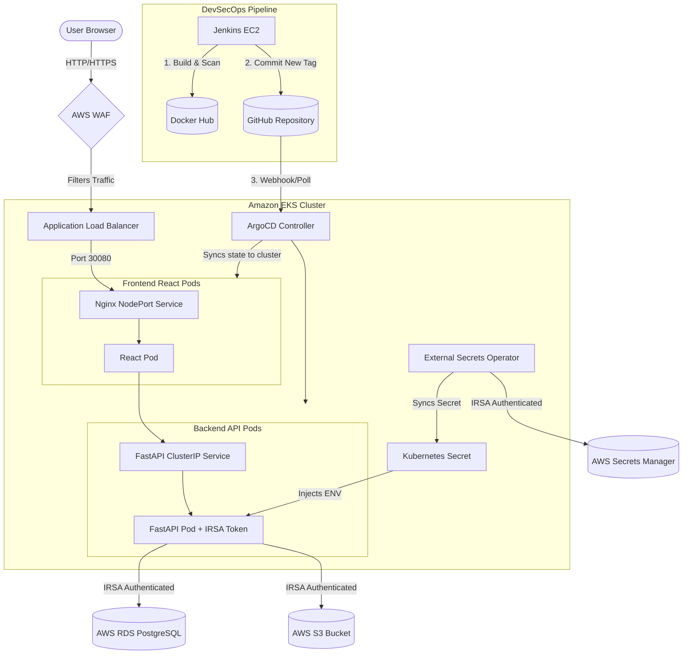

# AssembleMonitor — Cloud-Native Construction Site Management System


## 🎯 Product Overview

AssembleMonitor is a cloud-native construction site management platform designed to provide high-availability, scalable, and secure operations for enterprise construction teams. The platform ensures zero-downtime rollouts and resilient state management by leveraging a distributed microservices architecture deployed natively on Kubernetes.

## 🏗️ Architecture

The production-style cloud architecture is distributed across multiple AWS EC2 `c7i-flex.large` instances to separate concerns, isolate workloads, and maximize security.



## ⚙️ DevOps Implementation

This project was built from the ground up with a focus on automation, scalability, and observability, implementing the following core DevOps practices:

- **Cloud Infrastructure**: Architected a distributed microservices environment across optimized AWS EC2 compute nodes (`c7i-flex.large`), utilizing Auto Scaling Groups (ASG) and Application Load Balancers (ALB) for high availability.
- **Security & Secrets**: Protected by an AWS Web Application Firewall (WAF) to mitigate common exploits. Secrets are securely managed via AWS Secrets Manager and integrated into the cluster using the **External Secrets Operator (ESO)**. The underlying infrastructure utilizes **IAM Roles for Service Accounts (IRSA)** to restrict instance metadata access and enforce least privilege.
- **Database Decoupling**: Integrated a highly available AWS RDS PostgreSQL instance to decouple database state and ensure reliable data persistence.
- **Storage**: Implemented AWS S3 for secure, scalable object storage (e.g., site photos).
- **Continuous Integration / Continuous Deployment (CI/CD)**: An automated pipeline is orchestrated by Jenkins. The deployment strategy utilizes GitOps via ArgoCD to continuously synchronize Kubernetes cluster state with the Git repository, enabling immutable rolling updates.
- **DevSecOps**: Security validation is integrated into the CI pipeline (Shift-Left). SonarQube enforces static code analysis quality gates, and Trivy provides automated container vulnerability scanning prior to deployment.
- **Configuration Management**: Automated the provisioning and configuration of dedicated servers using Ansible playbooks for reproducible, idempotent setups.
- **Infrastructure as Code (IaC)**: Provisioned all AWS infrastructure (VPC, EC2, ASG, ALB, WAF, RDS, S3, Secrets Manager, CloudWatch) using Terraform to guarantee environment parity and infrastructure version control. Route 53 hosted zone and ACM certificate are written and plan-validated in `route53.tf`, but not applied. No domain is registered for this project. Public access uses the CloudFront default domain shown in the `cloudfront_domain_name` Terraform output.
- **Container Orchestration**: Orchestrated the full-stack application natively on a highly available Amazon EKS (Elastic Kubernetes Service) cluster, leveraging **Helm** templates, Deployments, NodePort Services, ConfigMaps, Secrets, Liveness/Readiness probes, and Horizontal Pod Autoscalers (HPA).
- **Observability**: Deployed Kubernetes Metrics Server for auto-scaling, alongside Prometheus and Grafana for deep cluster introspection. OpenTelemetry is deployed both as a DaemonSet for internal Kubernetes metrics and as a standalone deployment for externally scraping the manual EC2 nodes (Jenkins, K3s, SonarQube). AWS CloudWatch handles centralized logging and infrastructure alarms.
- **Dynamic Access**: Utilizes a custom `get-urls.sh` automation script to dynamically fetch AWS LoadBalancer endpoints for ArgoCD and Grafana on ephemeral cluster creation, completely eliminating manual port-forwarding.

## 🛠️ DevOps Tech Stack & Justification

Modern DevOps requires understanding _why_ a tool was chosen, not just how to use it.

| Category                   | Tool                      | Justification (The "Why")                                                                                |
| -------------------------- | ------------------------- | -------------------------------------------------------------------------------------------------------- |
| **Containerization**       | Docker                    | Ensures absolute environment parity between local dev and production EKS.                                |
| **Cloud Provider**         | AWS                       | Industry leader; utilized specialized components (WAF, Secrets Manager) for enterprise security.         |
| **CI Automation**          | Jenkins                   | Provides a highly-customizable, stateful execution environment for complex security pipelines.           |
| **GitOps CD**              | ArgoCD                    | Enforces Git as the single source of truth, drastically improving cluster stability and auditing.        |
| **Manifest Management**    | Helm                      | Enables DRY (Don't Repeat Yourself) templating for complex, multi-environment Kubernetes yaml files.     |
| **DevSecOps**              | SonarQube, Trivy          | Implements "Shift-Left" security, preventing vulnerable code and images from reaching the registry.      |
| **Configuration**          | Ansible                   | Ensures reproducible, idempotent OS-level configuration for dedicated CI and Security servers.           |
| **Infrastructure as Code** | Terraform                 | Provides declarative, reproducible, and version-controlled infrastructure scaling.                       |
| **Orchestration**          | Amazon EKS                | Managed control plane reduces operational overhead while providing native HPA and auto-healing.          |
| **Observability**          | Prometheus, Grafana       | Industry-standard metric aggregation providing real-time visibility into pod CPU/Memory and API latency. |
| **Secrets Management**     | External Secrets Operator | Eliminates hardcoded Base64 Kubernetes secrets by natively syncing with AWS Secrets Manager.             |

## 🚀 Deployment Architectures

This project supports multiple deployment architectures, ranging from local prototyping to full enterprise cloud orchestration. Each strategy is fully documented in the `docs/deployments/` directory.

| Architecture             | Best For                 | Tech Stack                  | Documentation                                     |
| ------------------------ | ------------------------ | --------------------------- | ------------------------------------------------- |
| **Local Docker**         | Rapid Prototyping        | Docker Compose              | [View Guide](docs/deployments/01-LOCAL-DOCKER.md) |
| **Manual EC2 (Legacy)**  | Pre-Kubernetes           | AWS EC2, ASG, ALB           | [View Guide](docs/deployments/02-MANUAL-EC2.md)   |
| **K3s Cluster**          | Standalone Orchestration | Kubernetes (K3s), Jenkins   | [View Guide](docs/deployments/03-K3S-CLUSTER.md)  |
| **Amazon EKS (Prod)**    | Enterprise Cloud         | EKS, ALB, AWS WAF, HPA      | [View Guide](docs/deployments/04-AWS-EKS-PROD.md) |
| **GitOps Orchestration** | Zero-Downtime Enterprise | ArgoCD, Helm, Jenkins, IRSA | [View Guide](docs/deployments/04-AWS-EKS-PROD.md) |

> **Note**: For EKS environments, run `./get-urls.sh` to dynamically fetch the LoadBalancer addresses for the ArgoCD and Grafana UIs after provisioning.

## 🔄 DevSecOps GitOps Pipeline

The deployment lifecycle is fully automated via a GitOps methodology:

1. **Source Code Checkout** from GitHub by Jenkins.
2. **SonarQube Static Analysis** and Quality Gate enforcement.
3. **Docker Image Build & Trivy Scan** to detect vulnerabilities.
4. **Docker Hub Push** to the centralized image registry.
5. **GitOps Manifest Update**: Jenkins updates the Helm `values/app.yaml` in the GitHub repository with the newly built image tag.
6. **ArgoCD Sync**: ArgoCD detects the change in GitHub and orchestrates a rolling update within the EKS cluster.

## 🔒 Security (AWS IRSA)

> [!IMPORTANT]  
> **Least Privilege Access:** To enforce the principle of least privilege, the EKS EC2 instances have their metadata endpoint (`hop_limit = 1`) restricted to prevent pods from assuming the server's IAM role. Instead, **IRSA (IAM Roles for Service Accounts)** is utilized to inject an OIDC-backed Web Identity Token directly into the backend Pod, granting it the specific permissions required to write to S3.

## 🧠 Lessons Learned & Architectural Trade-offs

A critical part of engineering is understanding trade-offs. Throughout this project, several key decisions were made:

- **EKS vs. K3s EC2**: Initially deployed on a single K3s EC2 instance to minimize AWS costs. However, as load testing (k6) revealed bottlenecks, the architecture was migrated to Amazon EKS. **Trade-off**: EKS incurs a higher baseline cost ($73/month control plane) but drastically reduces operational maintenance and provides superior Auto-Scaling (HPA).
- **Jenkins EC2 vs. GitHub Actions**: Opted for a self-hosted Jenkins EC2 instance rather than managed GitHub Actions. **Trade-off**: Requires manual patching and security group management, but enables strict, private network control over build server administration and agent configuration.
- **ALB NodePort vs. Ingress Controller**: Bypassed deploying an NGINX Ingress Controller inside EKS in favor of routing an external AWS ALB directly to Kubernetes NodePorts. **Trade-off**: Reduces in-cluster complexity and leverages native AWS WAF protection, though it couples the infrastructure heavily to Terraform rather than native Kubernetes YAML.
- **ArgoCD (GitOps) vs. Jenkins Direct Deployment**: Migrated from Jenkins pushing directly to Kubernetes via `kubectl` to a GitOps model where Jenkins only updates GitHub and ArgoCD handles the sync. **Trade-off**: Adds a new controller (ArgoCD) to the cluster overhead, but enforces absolute state immutability, drastically improves security (Jenkins no longer needs cluster admin credentials), and provides instant visual drift detection.

## 📸 Screenshots

Below is a highlight of the infrastructure and application. For the complete, comprehensive gallery covering all aspects (AWS, CI/CD, Kubernetes, Monitoring, Security), please refer to the full [System Screenshots](docs/SCREENSHOTS.md) and the `docs/screenshots/` directory.

### Architecture

_(Add your architecture diagram here: `docs/screenshots/01-architecture-diagram.png`)_

### Application

_(Add your landing page or dashboard here: `docs/screenshots/02-landing-page.png`)_

### AWS Infrastructure

_(Add your EC2 instances or ALB screenshot here: `docs/screenshots/14-ec2-instances.png`)_

### CI/CD & GitOps

_(Add your Jenkins pipeline success and ArgoCD Sync here: `docs/screenshots/27-jenkins-pipeline-success.png`)_

### Kubernetes Auto-Scaling

_(Add your cluster overview or pods here: `docs/screenshots/30-kubectl-get-pods.png`)_

### Monitoring

_(Add your Grafana dashboard here: `docs/screenshots/34-grafana-dashboard.png`)_

## ✨ Features

- **Role-Based Access Control (RBAC)**: Secure, distinct dashboards for Admins, Project Managers, Site Engineers, and Clients.
- **Phase & Task Management**: Break down construction projects into trackable phases and executable tasks.
- **Material Management**: Monitor inventory deliveries, stock levels, and daily resource consumption.
- **Site Photos**: Direct, secure upload of construction progress photos to AWS S3 using dynamically injected Web Identity Tokens.
- **Attendance & Expenses**: Track engineer working hours and log non-material project expenses.

## 💻 Application Tech Stack

- **Frontend**: React, Vite, HTML, CSS, Vanilla JavaScript
- **Backend API**: Python FastAPI, SQLAlchemy, Alembic (Migrations)
- **Database**: PostgreSQL (AWS RDS)
- **Storage**: AWS S3
- **Authentication**: JWT (JSON Web Tokens)
- **Web Server**: Nginx (Running inside the frontend Pod)

## 🐳 Local Development Environment

For rapid local testing and development, the application utilizes a streamlined Docker Compose environment:

```bash
docker compose up --build -d
docker compose exec api alembic upgrade head
```

- **Frontend**: `http://localhost:3000`
- **Backend API Docs**: `http://localhost:8000/docs`
- **Adminer DB UI**: `http://localhost:8080`

## 📚 Documentation

Extensive operational runbooks and architectural documentation can be found in the `docs/` folder:

- [Architecture Design Details](docs/ARCHITECTURE.md)
- [CI/CD Pipeline Flows](docs/CI_CD_PIPELINE.md)
- [Step-by-Step Deployment Guides](docs/DEPLOYMENT_GUIDE.md)
- [Infrastructure as Code (Terraform)](docs/INFRASTRUCTURE.md)
- [Security Posture](docs/SECURITY.md)
- [Operational Runbook & Disaster Recovery](docs/OPERATIONAL_RUNBOOK.md)
