# AssembleMonitor — Cloud-Native Construction Management Platform

<!-- Infrastructure & Cloud -->

[](https://aws.amazon.com/)
[](https://kubernetes.io/)
[](https://www.terraform.io/)
[](https://www.docker.com/)
[](https://www.ansible.com/)

<!-- CI/CD & DevSecOps -->

[](https://www.jenkins.io/)
[](https://argo-cd.readthedocs.io/)
[](https://helm.sh/)
[](https://www.sonarqube.org/)
[](https://trivy.dev/)

<!-- Observability -->

[](https://opentelemetry.io/)
[](https://prometheus.io/)
[](https://grafana.com/oss/loki/)
[](https://grafana.com/oss/tempo/)
[](https://grafana.com/)

<!-- Application Stack -->

[](https://react.dev/)
[](https://fastapi.tiangolo.com/)
[](https://www.postgresql.org/)
[](https://nginx.org/)

---

AssembleMonitor is a full-stack construction site management platform built and deployed on AWS using modern DevOps practices. The platform supports four RBAC roles — Admin, Project Manager, Site Engineer, and Client — and covers project phases, task tracking, material management, attendance, expenses, and secure photo uploads to S3.

The infrastructure spans two complete deployment paths: a **GitOps EKS pipeline** (primary production architecture) and a **K3s Jenkins pipeline** (lightweight orchestration). Both are fully automated and documented.

---

## ⚡ Project Highlights

|                       |                                                                                              |
| --------------------- | -------------------------------------------------------------------------------------------- |
| 🏗️ **Infrastructure** | EKS v1.36 · 2-node cluster (`c7i-flex.large`) · HPA 2→5 pods · ALB + WAFv2                   |
| 🔐 **Security**       | IMDSv2 enforced · IRSA for all pods · ESO (zero secrets in Git) · WAF rate-limit 2000 req/IP |
| 📊 **Observability**  | Full OTel pipeline: metrics → AMP, logs → Loki, traces → Tempo, all in Grafana               |
| 🔄 **GitOps**         | Jenkins → GitHub → ArgoCD → EKS · Zero `kubectl` in CI · ArgoCD self-heals drift             |
| 🛡️ **DevSecOps**      | SonarQube quality gates + Trivy CVE scanning on every build (shift-left)                     |
| 💰 **FinOps**         | Ephemeral cluster: `terraform destroy` nightly, `terraform apply` to restore in ~8 min       |

## Architecture

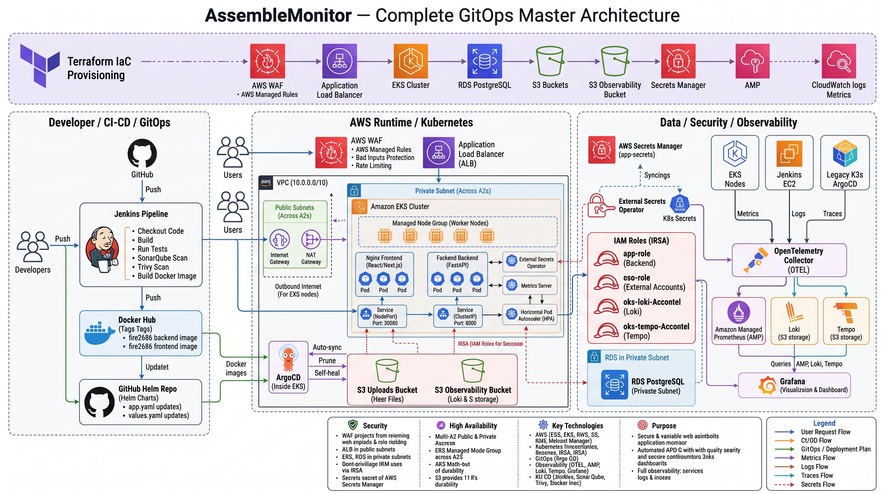

> The architecture spans an AWS WAF-protected Application Load Balancer routing into an Amazon EKS cluster across private subnets. The backend communicates with RDS PostgreSQL and S3 via IRSA-scoped IAM roles. An OpenTelemetry collector ships metrics to Amazon Managed Prometheus, logs to Loki, and traces to Tempo — all visualized in Grafana.

---

## Tech Stack

### Application

| Layer          | Technology                                                   |
| -------------- | ------------------------------------------------------------ |
| **Frontend**   | React 18, Vite 5, React Router v6, Vanilla CSS               |
| **Backend**    | Python FastAPI SQLAlchemy (async), Alembic                   |
| **Database**   | PostgreSQL 16 (AWS RDS)                                      |
| **Storage**    | AWS S3 (site photo uploads, versioned)                       |
| **Auth**       | JWT — python-jose + passlib/bcrypt, access + refresh tokens  |
| **Web Server** | Nginx (serves the React build inside the frontend container) |

### DevOps

| Category          | Tool                                | Why                                                                                |
| ----------------- | ----------------------------------- | ---------------------------------------------------------------------------------- |
| **Cloud**         | AWS                                 | Utilized WAF, Secrets Manager, RDS, EKS, AMP — purpose-built managed services      |
| **IaC**           | Terraform                           | Declarative, version-controlled infrastructure; full environment reproducibility   |
| **Containers**    | Docker                              | Guaranteed environment parity between local and production EKS                     |
| **Orchestration** | Amazon EKS                          | Managed control plane, native HPA, IRSA, EBS CSI — reduces operational overhead    |
| **CI**            | Jenkins (self-hosted EC2)           | Private network control, SonarQube integration, stateful build history             |
| **CD**            | ArgoCD (GitOps)                     | Git as single source of truth; zero Jenkins cluster credentials; drift detection   |
| **Manifests**     | Helm                                | DRY templating for multi-component, environment-parameterized Kubernetes manifests |
| **DevSecOps**     | SonarQube + Trivy                   | Shift-Left: quality gates and CVE scanning before any image reaches the registry   |
| **Config Mgmt**   | Ansible                             | Idempotent, reproducible OS-level provisioning for Jenkins, K3s, SonarQube servers |
| **Secrets**       | External Secrets Operator           | No base64 Kubernetes secrets in Git; synced live from AWS Secrets Manager          |
| **Observability** | OTEL + AMP + Loki + Tempo + Grafana | Full metrics, logs, and traces pipeline with pre-provisioned dashboards            |

---

## Application Features

The platform provides distinct dashboards for each RBAC role:

| Role                | Capabilities                                                          |
| ------------------- | --------------------------------------------------------------------- |
| **Admin**           | Full system access — user management, analytics, all project data     |
| **Project Manager** | Project and phase planning, task assignment, budget tracking          |
| **Site Engineer**   | Attendance logging, task updates, material consumption, photo uploads |
| **Client**          | Read-only visibility into project progress and status                 |

**Core modules:**

- **Project & Phase Management** — Hierarchical breakdown with status tracking
- **Task Management** — Assignment, status, priority, and deadline management
- **Material Management** — Inventory tracking with stock levels and usage logs
- **Attendance** — Engineer work-hour logging per project
- **Expenses** — Non-material cost tracking per project and phase
- **Site Photos** — Secure uploads directly to S3 using IRSA Web Identity Tokens
- **Notifications** — In-app notification system per user
- **Analytics** — Aggregated KPIs across projects, phases, and costs

---

## Deployment Paths

This project supports two distinct, fully automated deployment architectures. Each has its own Jenkins pipeline and is independently documented.

|                      | **Path 1 — EKS GitOps (Primary)**               | **Path 2 — K3s Pipeline**          |
| -------------------- | ----------------------------------------------- | ---------------------------------- |
| **Orchestration**    | Amazon EKS (managed control plane)              | K3s on AWS EC2                     |
| **CD Mechanism**     | ArgoCD (GitOps — syncs from GitHub)             | Jenkins direct `kubectl apply`     |
| **Manifest Format**  | Helm chart (`k8s/helm-chart/`)                  | Raw Kubernetes YAML (`k8s/*.yaml`) |
| **Secrets**          | External Secrets Operator → AWS Secrets Manager | Kubernetes `Secret` (base64)       |
| **Auto-Scaling**     | HPA (Metrics Server, 2–5 pods at 70% CPU)       | Manual replica control             |
| **Observability**    | Full OTEL + AMP + Loki + Tempo + Grafana        | Node Exporter + Prometheus         |
| **Jenkins Pipeline** | `Jenkinsfile-gitops`                            | `Jenkinsfile-k3s`                  |
| **Best For**         | Production, enterprise workloads                | Staging, lightweight environments  |

---

## Path 1 — EKS GitOps Pipeline (Primary)

### Pipeline Overview

```
Code Push → Jenkins → SonarQube QA → Trivy Scan → Docker Build
    → Docker Hub → [Manual Gate] → Git Helm Values Update
        → ArgoCD Auto-Sync → Rolling Update on EKS
```

The Jenkins pipeline (`Jenkinsfile-gitops`) covers the following stages end-to-end:

| Stage              | Action                                                                       |
| ------------------ | ---------------------------------------------------------------------------- |
| Checkout           | Pull latest source from GitHub                                               |
| Trivy FS Scan      | Scan backend and frontend source code for vulnerabilities                    |
| SonarQube Analysis | Static code analysis with Trivy findings piped in                            |
| Quality Gate       | Block pipeline if SonarQube gate fails                                       |
| Build Validation   | Docker build + `python -m compileall` to catch syntax errors                 |
| Build Final Images | Tag images with `BUILD_NUMBER` and `latest`                                  |
| Trivy Image Scan   | Scan built images for HIGH/CRITICAL CVEs                                     |
| Docker Hub Push    | Push `fire2686/assemblemonitor-backend:N` and `frontend:N`                   |
| Manual Approval    | 10-minute human gate before production rollout                               |
| GitOps Update      | `sed` image tags in `k8s/helm-chart/values/app.yaml`, commit, push to `main` |
| ArgoCD Sync        | ArgoCD detects the Git change and performs a rolling update automatically    |

### EKS Infrastructure

Provisioned entirely by Terraform (`terraform/`):

| Component         | Details                                                                            |
| ----------------- | ---------------------------------------------------------------------------------- |
| **EKS Cluster**   | Kubernetes v1.36, public + private endpoint access                                 |
| **Node Group**    | `c7i-flex.large`, On-Demand, 2 desired / 2 min / 3 max                             |
| **Networking**    | Private subnets in 2 AZs (172.31.96.0/24, 172.31.97.0/24) via NAT Gateway          |
| **Load Balancer** | AWS ALB → EKS NodePort 30080 via ASG attachment                                    |
| **WAF**           | WAFv2: Common Rules, Known Bad Inputs, rate-limit 2000 req/IP per window           |
| **Database**      | RDS PostgreSQL `db.t4g.micro`, private subnets, no public access                   |
| **Storage**       | S3 uploads bucket (versioned) + S3 observability bucket (Loki/Tempo chunks)        |
| **Secrets**       | AWS Secrets Manager + External Secrets Operator syncing to Kubernetes              |
| **EKS Add-ons**   | EBS CSI Driver, Metrics Server, External Secrets Operator — all via `helm_release` |
| **ArgoCD**        | Installed via Terraform `helm_release`, auto-configured with `argocd-apps`         |

### Security — IRSA (IAM Roles for Service Accounts)

All pod-level AWS access is granted through IRSA with IMDSv2 `hop_limit=1` enforced on nodes — pods cannot reach the EC2 instance metadata endpoint and cannot assume the node's IAM role.

| Role                | Service Account                     | Permissions                    |
| ------------------- | ----------------------------------- | ------------------------------ |
| `app-role`          | `assemblemonitor-backend-sa`        | S3 (uploads), Secrets Manager  |
| `eso-role`          | `external-secrets/external-secrets` | Secrets Manager GetSecretValue |
| `otel-irsa-role`    | `otel-collector`                    | AMP RemoteWriteAccess          |
| `grafana-irsa-role` | `grafana`                           | AMP QueryAccess                |
| `obs-backend-irsa`  | `loki`, `tempo`                     | S3 observability bucket        |
| `ebs-csi-role`      | `ebs-csi-controller-sa`             | EBS volume provisioning        |

### Kubernetes Workloads (Helm Chart)

The umbrella Helm chart (`k8s/helm-chart/`) manages the entire `assemblemonitor` namespace:

**Application layer** (`values/app.yaml`):

- Backend deployment — FastAPI, ClusterIP service port 8000, HPA 2→5 pods
- Frontend deployment — React/Nginx, NodePort service port 30080, HPA 2→5 pods
- External Secrets Operator sync from `assemblemonitor/dev/app-secrets`
- Liveness and readiness probes on `/api/health`

**Observability layer** (`values/observability.yaml`):

| Component               | Version | Role                                                                  |
| ----------------------- | ------- | --------------------------------------------------------------------- |
| Loki                    | 6.29.0  | Log aggregation → S3 backend                                          |
| Tempo                   | 1.8.0   | Distributed tracing → S3 backend                                      |
| kube-state-metrics      | 5.15.2  | Kubernetes object metrics                                             |
| OpenTelemetry Collector | chart 0.114.0 / image 0.157.0 | DaemonSet: cAdvisor + KSM metrics, filelog, OTLP traces               |
| Grafana                 | 10.4.2  | Visualization — datasources provisioned via ConfigMap                 |
| otel-external-scraper   | —       | Standalone deployment scraping Jenkins, K3s, SonarQube node exporters |

### Observability Pipelines

```
# Metrics
cAdvisor + kube-state-metrics → OTEL DaemonSet → SigV4 remote write → Amazon Managed Prometheus → Grafana

# Logs
/var/log/pods (filelog receiver) → OTEL DaemonSet → Loki → S3 observability bucket → Grafana

# Traces
FastAPI (OTLP gRPC) → OTEL DaemonSet → Tempo → S3 observability bucket → Grafana

# External EC2 Metrics
Jenkins:9100 + K3s:9100 + SonarQube:9100 → otel-external-scraper → AMP → Grafana
```

### CloudWatch Alarms

| Alarm                 | Threshold      |
| --------------------- | -------------- |
| ALB unhealthy targets | > 0 hosts      |
| ALB 5xx errors        | > 5 per minute |
| RDS CPU utilization   | > 80%          |
| RDS free storage      | < 2 GB         |
| ASG CPU utilization   | > 80%          |

### Prerequisites

| Tool      | Version | Purpose                                  |
| --------- | ------- | ---------------------------------------- |
| AWS CLI   | v2.x    | Configure credentials and kubeconfig     |
| Terraform | >= 1.6  | Provision all infrastructure             |
| kubectl   | >= 1.29 | Interact with EKS cluster                |
| Helm      | >= 3.14 | Inspect/override chart values (optional) |
| Docker    | >= 25   | Local builds and testing                 |

### Deploying the EKS Stack

```bash
# 1. Provision all infrastructure (EKS, ALB, WAF, RDS, S3, ArgoCD, ESO, Metrics Server)
cd terraform
cp terraform.tfvars.example terraform.tfvars   # fill in your values
terraform init
terraform apply

# 2. Configure kubectl
aws eks update-kubeconfig --region us-east-1 --name assemblemonitor-advance-dev-eks

# 3. Verify pods are running (ArgoCD syncs automatically after terraform apply)
kubectl get pods -n assemblemonitor

# 4. Get live service URLs (ArgoCD UI + Grafana LoadBalancer endpoints)
./get-urls.sh

# 5. Get the application URL
terraform output alb_url
```

> **Ephemeral Cluster Note:** The EKS cluster is torn down nightly to manage costs. All components — ArgoCD, Metrics Server, ESO, Loki, Tempo, OTEL, Grafana — are provisioned automatically by Terraform on every `apply`. No manual `helm install` or `kubectl apply` commands are required.

---

## Path 2 — K3s Jenkins Pipeline

### Pipeline Overview

```
Code Push → Jenkins → SonarQube QA → Trivy Scan → Docker Build
    → Docker Hub → [Manual Gate] → kubectl apply → K3s Rolling Update
```

The Jenkins pipeline (`Jenkinsfile-k3s`) handles the full build, scan, and deploy cycle against a K3s cluster running on a standalone AWS EC2 instance.

### K3s Infrastructure

| Component      | Details                                                                |
| -------------- | ---------------------------------------------------------------------- |
| **Kubernetes** | K3s on a single AWS EC2 instance                                       |
| **Manifests**  | Raw YAML in `k8s/` (Deployment, Service, ConfigMap, Secret, Namespace) |
| **Secrets**    | Kubernetes `Secret` (base64-encoded), applied via `k8s/secret.yaml`    |
| **Services**   | Frontend: NodePort 30080 — Backend: NodePort 30081                     |
| **Monitoring** | Prometheus node-exporter (systemd, installed via Ansible playbook)     |

### Deploying to K3s

**Automated (Jenkins — recommended):**

1. Push code to the `main` branch.
2. In the Jenkins UI (port 8080), trigger **Build Now** on `AssembleMonitor-Pipeline`.
3. Approve the deployment prompt at the manual gate.

**Manual (debug):**

```bash
# SSH into the K3s server
ssh -i your-key.pem ubuntu@<K3S_PUBLIC_IP>

# Pull latest manifests
cd ~/AssembleMonitor && git pull origin main

# Apply namespace, config, and secrets
kubectl apply -f k8s/namespace.yaml
kubectl apply -f k8s/secret.yaml
kubectl apply -f k8s/configmap.yaml

# Apply workloads
kubectl apply -f k8s/backend-deployment.yaml
kubectl apply -f k8s/backend-nodeport-service.yaml
kubectl apply -f k8s/frontend-deployment.yaml
kubectl apply -f k8s/frontend-service.yaml
```

**Access:**

| Service     | URL                                       |
| ----------- | ----------------------------------------- |
| Frontend    | `http://<K3S_PUBLIC_IP>:30080`            |
| Backend API | `http://<K3S_PUBLIC_IP>:30081/api/health` |

> Ensure AWS Security Group allows inbound TCP on ports 30080 and 30081.

---

## Local Development

For rapid local iteration, the full stack runs with Docker Compose:

```bash
# Start all services (Frontend + Backend + PostgreSQL + Adminer)
docker compose up --build -d

# Run database migrations
docker compose exec api alembic upgrade head

# Seed an admin account
docker compose exec api python seed_admin.py
```

| Service               | URL                            |
| --------------------- | ------------------------------ |
| Frontend              | http://localhost:3000          |
| Backend API + Swagger | http://localhost:8000/api/docs |
| Adminer (DB GUI)      | http://localhost:8080          |

---

## Screenshots

### 🔄 CI/CD & GitOps

**Jenkins GitOps Pipeline (17 stages)**


**ArgoCD Application — Synced to EKS**


**ArgoCD Application Topology**
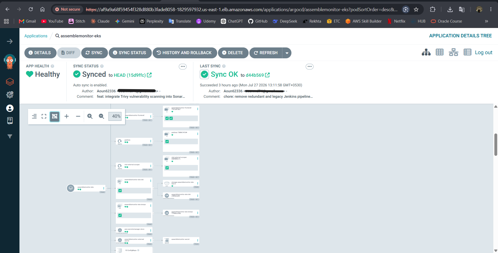

**SonarQube Code Quality Gate (Backend + Frontend)**


**Trivy Container Image Scan**
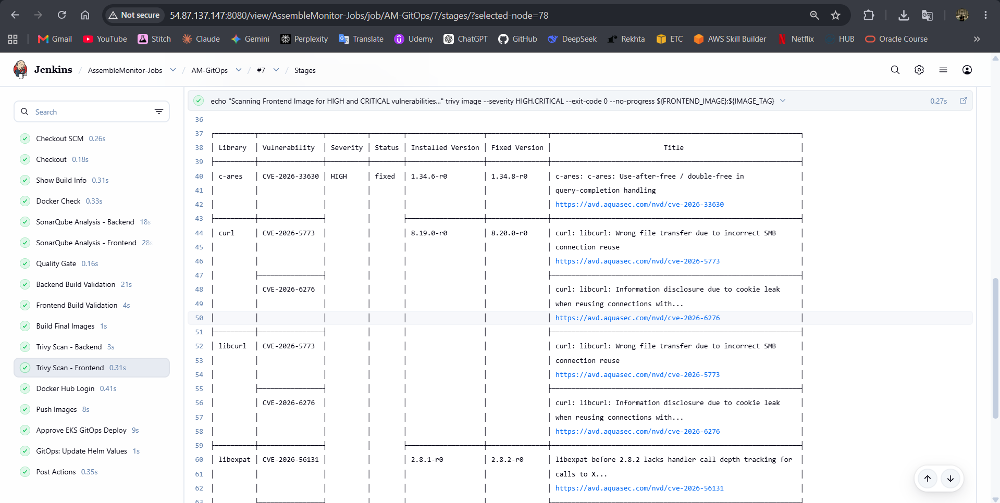

---

### 📊 Observability

**Kubernetes Overview Dashboard (Grafana + AMP)**


**Loki Log Aggregation in Grafana**
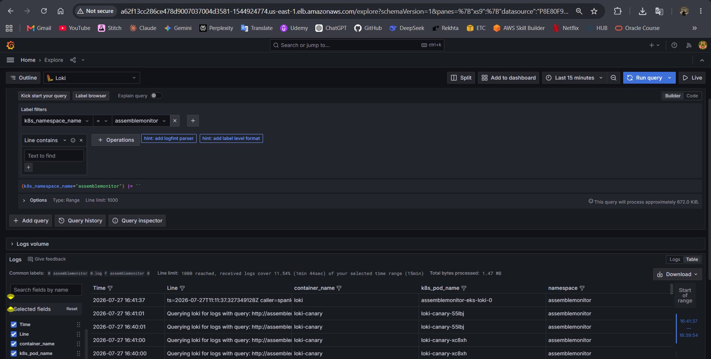

**Tempo Distributed Traces in Grafana**
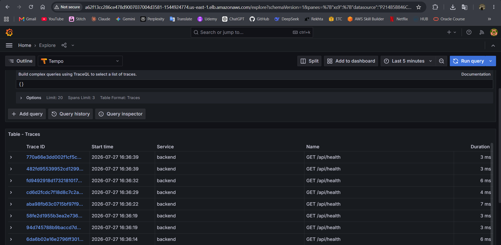

**CloudWatch Infrastructure Alarms**
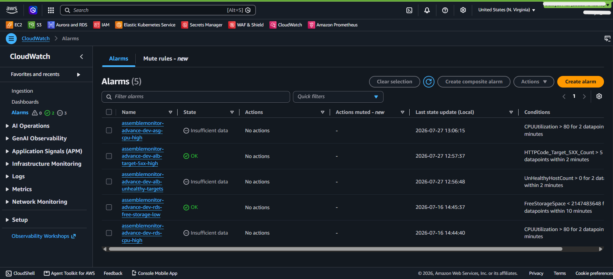

---

### 🏗️ Infrastructure

**EKS Cluster — Nodes, Pods, Services, HPA**


**AWS Secrets Manager Integration**
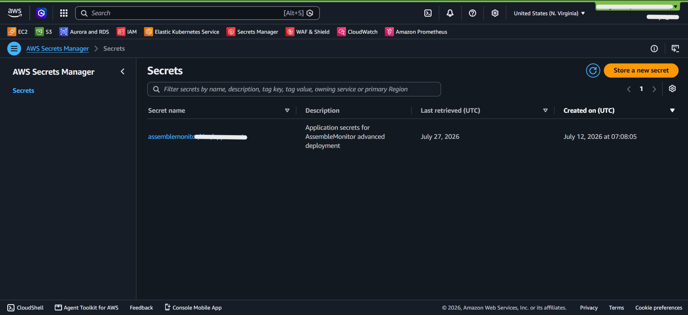

**k6 Load Test Summary**
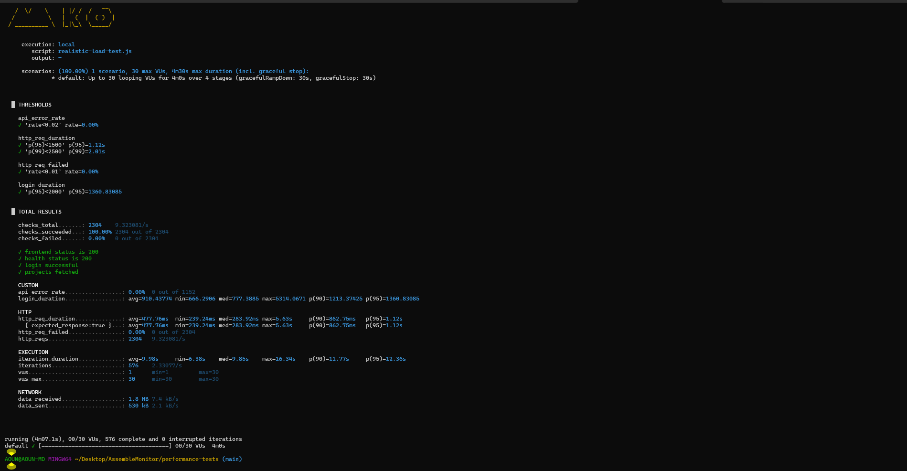

---

### 💻 Application

**Landing Page**


**Admin Dashboard**
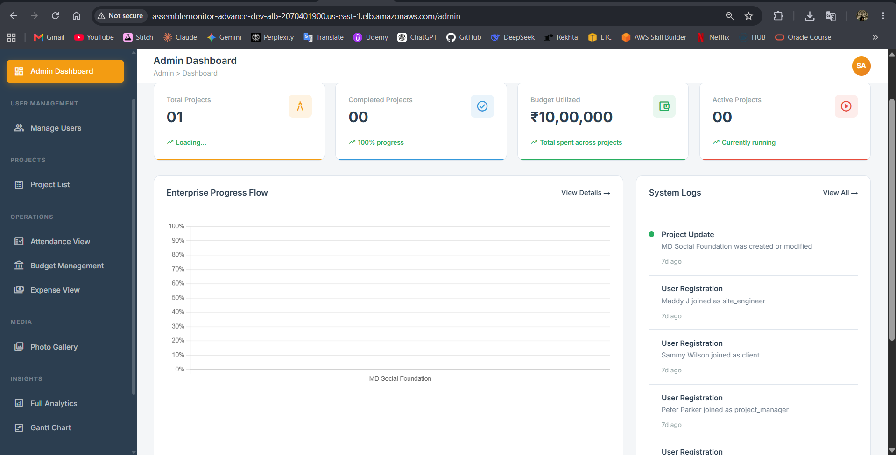

**Site Photo Gallery (S3-backed)**
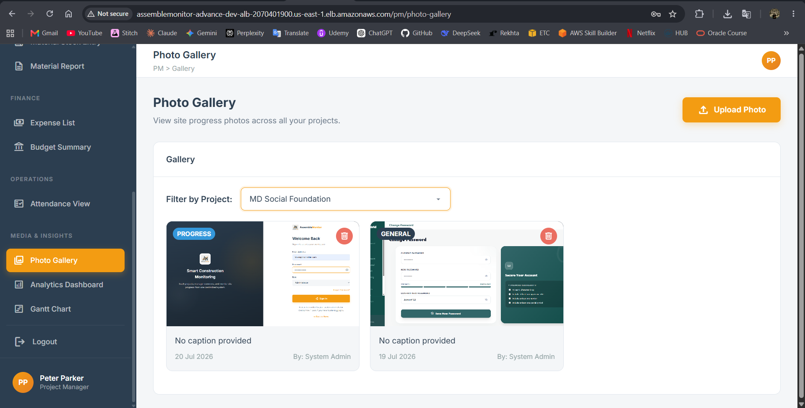

**FastAPI Swagger UI**
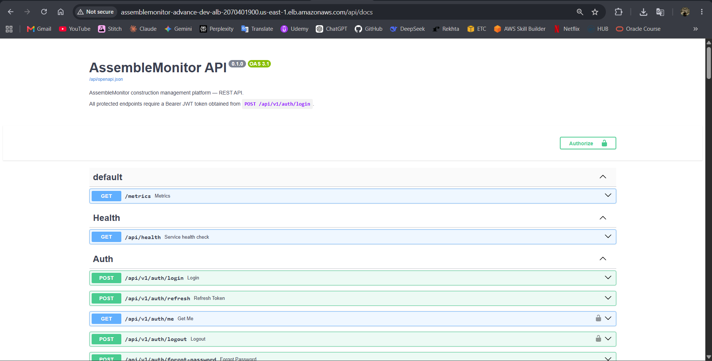

---

## Documentation

| Document                                               | Content                                      |
| ------------------------------------------------------ | -------------------------------------------- |
| [Architecture](docs/architecture/ARCHITECTURE.md)      | Detailed component-level architecture        |
| [CI/CD Pipeline](docs/ops/CI_CD_PIPELINE.md)           | Stage-by-stage pipeline breakdown            |
| [Infrastructure](docs/ops/INFRASTRUCTURE.md)           | Terraform resource reference                 |
| [Security](docs/architecture/SECURITY.md)              | IRSA, WAF, ESO, network security posture     |
| [Operational Runbook](docs/ops/OPERATIONAL_RUNBOOK.md) | Incident response and operational procedures |
| [Incident Response](docs/ops/INCIDENT_RESPONSE.md)     | RTO/RPO targets and disaster recovery        |
| [Performance Testing](performance-tests/README.md)     | k6 load test methodology and results         |
| [FinOps](docs/ops/FINOPS_COST_MANAGEMENT.md)           | Cost breakdown and optimization decisions    |

### Deployment Guides

| Guide                                                            | Architecture               |
| ---------------------------------------------------------------- | -------------------------- |
| [01 — Local Docker Compose](docs/deployments/01-LOCAL-DOCKER.md) | Full stack locally         |
| [03 — K3s Cluster](docs/deployments/03-K3S-CLUSTER.md)           | Lightweight Kubernetes     |
| [04 — Amazon EKS (Primary)](docs/deployments/04-AWS-EKS-PROD.md) | Production GitOps          |

---

## Engineering Decisions

| Decision                                     | Trade-off                                                                                                                                  |
| -------------------------------------------- | ------------------------------------------------------------------------------------------------------------------------------------------ |
| **ALB NodePort over Ingress Controller**     | Couples networking to Terraform; gains native AWS WAF integration and removes in-cluster ingress complexity                                |
| **ArgoCD GitOps over Jenkins direct deploy** | Adds ArgoCD controller overhead; eliminates Jenkins cluster-admin credentials, enforces state immutability, enables visual drift detection |
| **EKS over K3s**                             | $73/month managed control plane cost; eliminates etcd management, delivers native HPA and IRSA                                             |
| **ESO over base64 Secrets**                  | Requires the ESO operator; removes all secrets from Git entirely and enables secret rotation without redeployment                          |
| **Self-hosted Jenkins over GitHub Actions**  | Requires server maintenance; provides private network isolation for builds and full SonarQube integration without egress                   |

---

## Challenges & Lessons Learned

- **Observability Stack Integration:** Setting up the full observability pipeline across Tempo, OpenTelemetry (OTEL), Loki, and Amazon Managed Prometheus (AMP) was one of the most challenging aspects. I encountered several version conflicts between the OTEL collector, Prometheus receivers, and the Loki/Tempo backend APIs. Resolving these required deep-diving into compatibility matrices and carefully tuning the OTEL DaemonSet configurations to ensure logs, metrics, and traces flowed correctly into Grafana without data loss.
- **GitOps and Ephemeral Infrastructure:** Because the EKS cluster is destroyed nightly to save costs, the entire cluster bootstrap process had to be 100% automated. Ensuring that Terraform reliably provisioned the infrastructure and handed off seamlessly to ArgoCD for application state without any manual intervention taught me the true value of immutable, declarative infrastructure.
