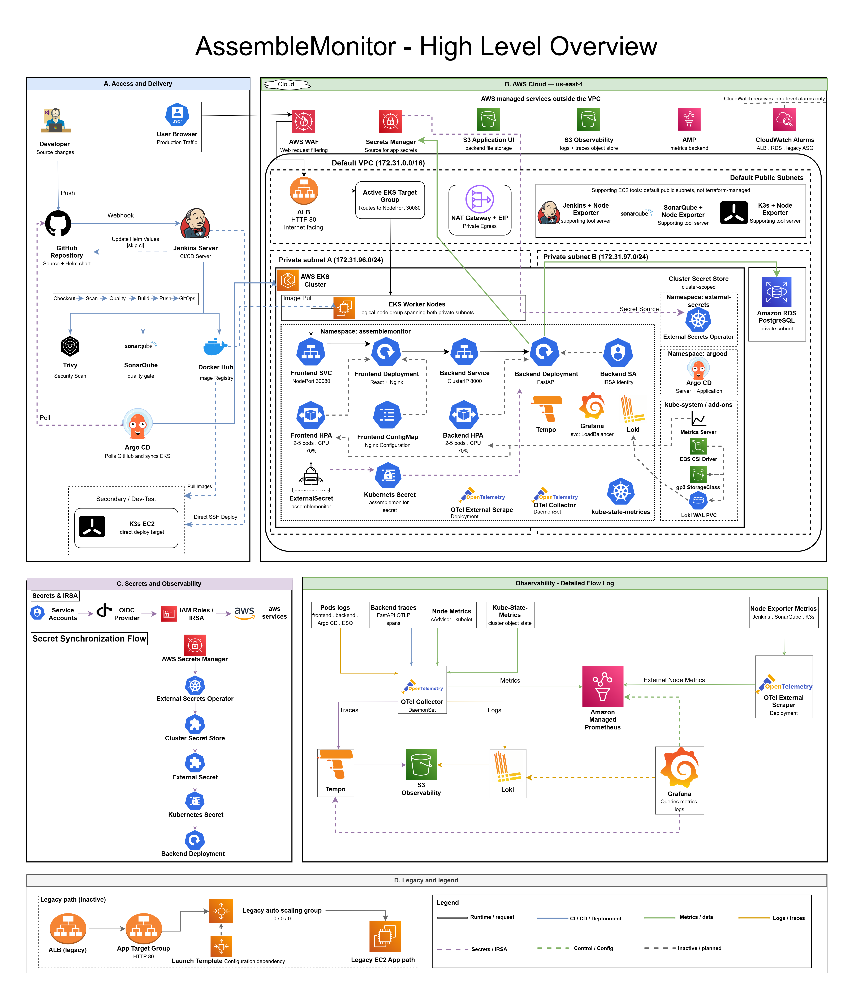
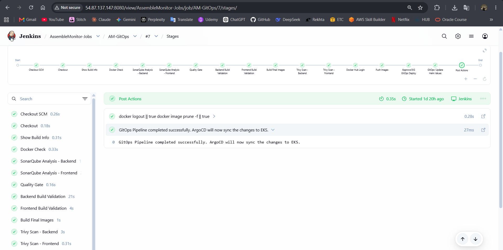
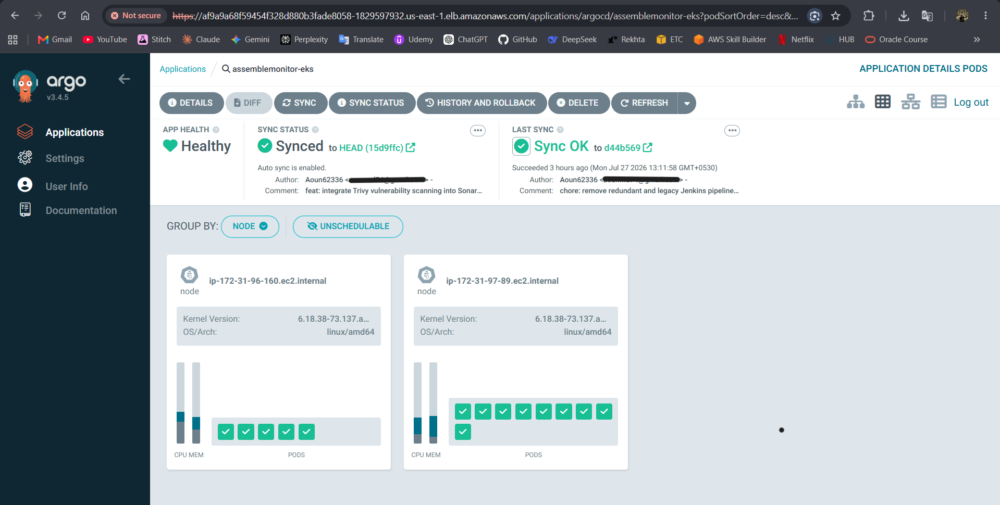
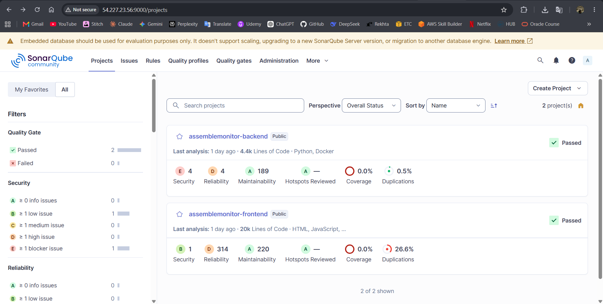
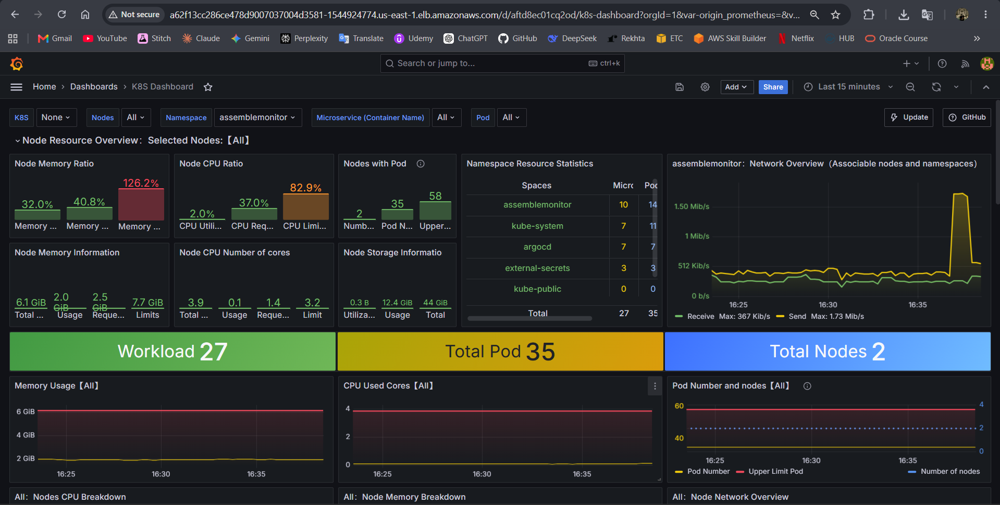
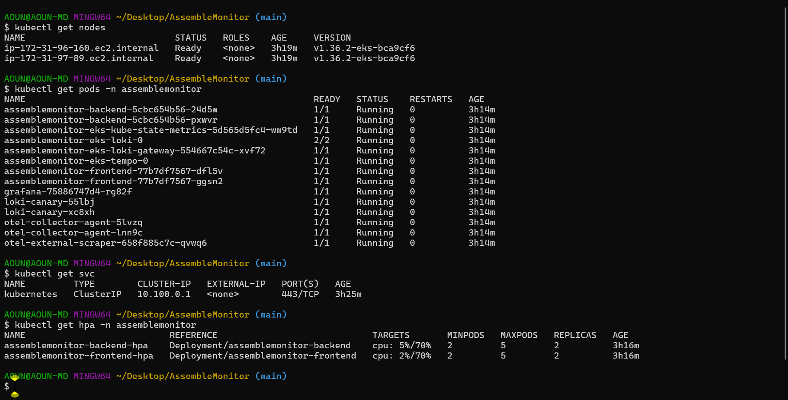

# AssembleMonitor — Construction Site Management Platform

<!-- Infrastructure & Cloud -->

[](https://aws.amazon.com/)
[](https://kubernetes.io/)
[](https://www.terraform.io/)
[](https://www.docker.com/)

<!-- CI/CD & DevSecOps -->

[](https://www.jenkins.io/)
[](https://argo-cd.readthedocs.io/)
[](https://github.com/Aoun62336/AssembleMonitor-DevOps/actions/workflows/pr-validation.yml)

<!-- Observability -->

[](https://opentelemetry.io/)
[](https://prometheus.io/)
[](https://grafana.com/)

<!-- Application Stack -->

[](https://fastapi.tiangolo.com/)

---

AssembleMonitor is a construction site management platform built with **React, FastAPI and PostgreSQL**. The application was developed during a software-development internship. After the application foundation was in place, I independently designed and implemented the Cloud/DevOps platform around it — AWS infrastructure, Terraform, Docker, Kubernetes/EKS, Jenkins CI/CD, GitOps with Argo CD, Helm, security controls, observability, and reliability validation.

The repository therefore contains two distinct layers:

- **Application layer** — React + FastAPI + PostgreSQL
- **Cloud/DevOps layer** — AWS + Terraform + Docker + Kubernetes/EKS + Jenkins + Helm + Argo CD + security + observability + reliability tooling

---

## What I Implemented

| Area | What I implemented | Repository evidence |
|---|---|---|
| **AWS infrastructure** | Designed and provisioned EKS, private networking, NAT, ALB, WAF, RDS, S3, IAM, Secrets Manager, and CloudWatch using Terraform | `terraform/*.tf` |
| **Terraform** | Wrote the full infrastructure definition; extracted private-networking into a reusable module with 5 native tests | `terraform/modules/network/` |
| **Containerization** | Built production Docker images for backend and frontend; integrated into CI/CD | `backend/Dockerfile`, `frontend/Dockerfile`, `Jenkinsfile-gitops` |
| **Jenkins CI/CD** | Built the multi-stage pipeline: source validation, security scanning, image builds, registry publication, and GitOps handoff | `Jenkinsfile-gitops` |
| **GitOps / CD** | Implemented Helm-based GitOps where Jenkins commits the image tag to Git and Argo CD reconciles EKS | `Jenkinsfile-gitops`, `k8s/helm-chart/`, `k8s/argocd-application.yaml` |
| **Kubernetes** | Defined Deployments, Services, HPA, probes, resource limits, security contexts, PDBs, and NetworkPolicies | `k8s/helm-chart/templates/` |
| **Secrets / IAM** | Implemented IRSA + AWS Secrets Manager + External Secrets Operator for workload identity and secret delivery | `terraform/iam.tf`, `terraform/secrets.tf`, `k8s/helm-chart/templates/serviceaccount.yaml` |
| **Observability** | Integrated OpenTelemetry telemetry pipeline: AMP/Prometheus metrics, Loki logs, Tempo traces, Grafana dashboards | `docker/otel-collector-config.yaml`, `k8s/helm-chart/` |
| **Reliability** | Implemented separated liveness/readiness probes, PDB/NetworkPolicy validation, and controlled fault drills | `backend/app/routers/health.py`, `scripts/fault-drills/`, `docs/ops/incidents/` |

→ [Full implementation record](docs/DEVOPS_IMPLEMENTATION.md)

---

## Architecture Overview



> The system integrates a Jenkins GitOps CI/CD pipeline, a WAF-protected ALB routing to Amazon EKS in private subnets, IRSA-secured workloads, External Secrets Operator synchronization from AWS Secrets Manager, and an OpenTelemetry pipeline directing metrics to AMP, logs to Loki, and traces to Tempo — all visualized in Grafana.

→ [Architecture documentation](docs/architecture/ARCHITECTURE.md)

---

## Technology Stack

### Application Layer

| Component | Technology |
|---|---|
| **Frontend** | React 18 · Vite 5 · React Router v6 |
| **Backend** | Python FastAPI · SQLAlchemy (async) · Alembic |
| **Database** | PostgreSQL 16 (Amazon RDS) |
| **Storage** | Amazon S3 (versioned site artifact storage) |
| **Authentication** | JWT via python-jose and passlib/bcrypt |
| **Web Server** | Nginx (frontend asset delivery) |

### DevOps Technology Stack — What I Used and Why

| Technology | How it is used here | Why it was used |
|---|---|---|
| **AWS** | EKS, VPC, ALB, WAF, RDS, S3, IAM, Secrets Manager, CloudWatch, AMP | Managed cloud platform with native Kubernetes, identity, and observability integration |
| **Terraform** | All AWS and supporting Helm infrastructure | Reproducible, version-controlled infrastructure; avoids configuration drift |
| **Docker** | Backend and frontend production container images | Consistent runtime artifact across local, CI, and EKS environments |
| **Kubernetes / EKS** | Application orchestration | Self-healing workloads, declarative deployment, HPA scaling, workload isolation |
| **Helm** | Umbrella chart for all Kubernetes manifests | Parameterized templates; environment-specific values files |
| **Jenkins** | Main CI/release pipeline | Stateful build history, SonarQube integration, image security gates, GitOps handoff |
| **GitHub Actions** | Pre-merge validation (5 parallel jobs) | Fast repository-native checks before merge; no Jenkins infrastructure needed |
| **Argo CD** | Continuous delivery | Git is the desired-state source; Argo CD reconciles EKS without Jenkins cluster-admin credentials |
| **SonarQube** | Static analysis | Code-quality and security gate enforced before any image reaches the registry |
| **Trivy** | Filesystem + image scanning | Detect dependency and container vulnerabilities before registry publication |
| **Gitleaks** | Secret scanning | Prevent credentials from entering the repository history |
| **External Secrets Operator** | AWS Secrets Manager → Kubernetes Secret synchronization | Keep all application secrets out of Git |
| **IRSA** | Pod-to-AWS identity | Eliminate static AWS credentials inside workloads |
| **OpenTelemetry** | Telemetry collection pipeline | Unified receiver for metrics, logs, and traces |
| **AMP / Prometheus** | Metrics storage and querying | Kubernetes and application metrics with managed retention |
| **Loki** | Log aggregation | Centralized log collection from all pods |
| **Tempo** | Distributed tracing | End-to-end trace storage for FastAPI requests |
| **Grafana** | Visualization | Unified dashboards for all three telemetry signals |
| **Ansible** | EC2 host configuration | Repeatable, idempotent setup for Jenkins, K3s, and SonarQube nodes |

---

## End-to-End Delivery Flow

```text
Developer change
      ↓
GitHub Pull Request
      ↓
GitHub Actions (pre-merge validation)
  ├── backend-test
  ├── frontend-build
  ├── terraform-validate
  ├── helm-validate
  └── secret-scan
      ↓
Merge to main
      ↓
Jenkins (Jenkinsfile-gitops)
  ├── Trivy filesystem scan
  ├── SonarQube analysis + quality gate
  ├── Docker build (backend + frontend)
  ├── Trivy image scan
  └── Docker Hub push
      ↓
Manual production approval gate
      ↓
Jenkins commits updated image tag → k8s/helm-chart/values/app.yaml
      ↓
Argo CD detects Git change
      ↓
Argo CD reconciles desired state into EKS
      ↓
Rolling deployment → readiness probe validation
      ↓
OTel / AMP / Loki / Tempo / Grafana
```

> **Key distinction:** Jenkins does not apply Kubernetes manifests directly. Jenkins builds the release and commits the new image tag to Git. Argo CD is the component that reconciles the Git-defined desired state into EKS. This separation is fundamental to the GitOps model — the cluster's desired state is always a Git commit, not a CI pipeline execution.

---

## Deployment Architectures

| Specification | Path 1 — EKS GitOps (Primary) | Path 2 — K3s Pipeline |
|---|---|---|
| **Orchestration** | Amazon EKS (Managed Control Plane) | K3s (Self-managed EC2) |
| **CD Mechanism** | Argo CD (GitOps synchronization) | Jenkins (`kubectl apply` via SSH) |
| **Manifest Format** | Helm Chart (`k8s/helm-chart/`) | Kubernetes YAML (`k8s/*.yaml`) |
| **Secret Management** | External Secrets Operator → AWS Secrets Manager | Kubernetes `Secret` (Base64, gitignored) |
| **Auto-Scaling** | HPA (Metrics Server, 2–5 replicas) | Manual |
| **Observability** | OTel + AMP + Loki + Tempo + Grafana | Node Exporter + Prometheus |
| **Jenkins Pipeline** | `Jenkinsfile-gitops` | `Jenkinsfile-k3s` |

### EKS Infrastructure (Terraform-provisioned)

| Component | Specification |
|---|---|
| **EKS Cluster** | Kubernetes v1.36 · public + private endpoint access |
| **Node Group** | `c7i-flex.large` · On-Demand · Auto Scaling (2 min / 3 max) |
| **Networking** | Private subnets across 2 AZs · NAT Gateway for node egress |
| **Load Balancer** | AWS ALB → EKS NodePort (30080) |
| **WAF** | WAFv2 · CommonRuleSet · KnownBadInputs · rate-limit (2000 req/IP/window) |
| **Database** | Amazon RDS PostgreSQL (`db.t4g.micro`) · private subnets |
| **Storage** | Amazon S3 · versioned artifact bucket + observability backend |
| **Secret Management** | AWS Secrets Manager + External Secrets Operator |
| **EKS Add-ons** | EBS CSI Driver · Metrics Server · ESO via `helm_release` |
| **Argo CD** | Provisioned via Terraform `helm_release` |

### Security — IAM Roles for Service Accounts (IRSA)

Pod-level AWS API access is authenticated exclusively via IRSA. IMDSv2 is enforced on all nodes with `hop_limit=1`, preventing pods from querying the EC2 metadata service to assume the underlying node role. Six distinct IRSA roles enforce least-privilege access across service accounts (Backend, ESO, OTel Collector, Grafana, Loki/Tempo, EBS CSI).

→ [Security documentation](docs/architecture/SECURITY.md)

### Kubernetes Workload Configuration

The umbrella Helm chart (`k8s/helm-chart/`) manages the `assemblemonitor` namespace via `values/app.yaml` and `values/observability.yaml`.

- **Backend**: FastAPI · ClusterIP (Port 8000) · HPA (2→5) · liveness and readiness probes
- **Frontend**: React/Nginx · NodePort (30080) · HPA (2→5)
- **Security context**: non-root · no privilege escalation · dropped capabilities
- **PDB**: `maxUnavailable: 1` for both deployments
- **NetworkPolicy**: selected frontend/backend isolation (enabled via `values/hardening-validation.yaml`)

### EKS Deployment

```bash
cd terraform && cp terraform.tfvars.example terraform.tfvars
terraform init && terraform apply
aws eks update-kubeconfig --region us-east-1 --name <EKS_CLUSTER_NAME>
kubectl get pods -n assemblemonitor
./get-urls.sh
```

> **Cost-controlled lifecycle:** The paid AWS environment was torn down after implementation and validation to control personal cloud costs. Terraform, Helm, GitOps configuration, and runbooks preserve the full deployment design and reprovisioning workflow.

---

## Observability Pipeline

```text
Application / Kubernetes
        ↓
OpenTelemetry Collector (DaemonSet)
  ├── Metrics  →  Amazon Managed Prometheus (AMP)
  ├── Logs     →  Loki  →  Amazon S3
  └── Traces   →  Tempo  →  Amazon S3
                                ↓
                            Grafana (unified dashboards)
```

FastAPI is instrumented for distributed traces. The OTel Collector DaemonSet receives all signals, routes metrics to AMP, logs to Loki, and traces to Tempo. External EC2 nodes (Jenkins, SonarQube) are monitored via a separate `otel-external-scraper` deployment.

---

## Problems I Encountered

### 1 — Jenkins K3s deployment: SSH target over private IP

**Problem:** The `Jenkinsfile-k3s` pipeline needed to SSH into the K3s EC2 instance to run `kubectl apply`. The deployment target had to be the instance's **private IP**, not the public IP, because Jenkins runs inside the same VPC and using the public IP is both unnecessary and unreliable across restarts.

**Resolution:** Implemented a dedicated `Find K3s EC2` pipeline stage that uses `aws ec2 describe-instances` with tag and state filters to resolve the private IP dynamically at runtime, writes it to `k3s_private_ip.txt`, and all subsequent SSH stages read from that file. This makes the deployment path reliable regardless of EC2 instance restarts.

**Evidence:** `Jenkinsfile-k3s` — stages `Find K3s EC2` through `Post-Deploy Verification`

---

### 2 — OpenTelemetry collector configuration corrections

**Problem:** The observability stack required configuration corrections to align the collector container path and Prometheus environment settings before telemetry routing worked end-to-end.

**Resolution:** Corrected the collector container configuration and Prometheus-related environment syntax. Validated the telemetry pipeline by confirming FastAPI traces appearing in the OTel Collector output (`TracesExporter {"resource spans": 1, "spans": 3}`).

**Evidence:** `docker/otel-collector-config.yaml` · `k8s/helm-chart/` · observability screenshots

---

### 3 — Argo CD diff on ExternalSecret resource

**Problem:** Argo CD reported a configuration difference for the `ExternalSecret` resource — the controller was adding default fields that were not present in the Git-defined resource, causing perpetual out-of-sync state.

**Resolution:** Explicitly declared the defaulted ExternalSecret fields in the Helm template so the Git-defined resource matched the controller's expected representation. The diff resolved.

**Evidence:** `k8s/helm-chart/templates/external-secret.yaml`

---

### 4 — Health probe architecture: liveness must not depend on the database

**Problem:** The original design used a single `/health` endpoint for both liveness and readiness. This meant a database outage would eventually cause Kubernetes to restart the FastAPI pod — even though the application process itself was healthy and capable of recovering once the database came back.

**Why this matters:** A readiness failure should remove the pod from traffic routing without restarting it. A liveness failure should restart the process. Conflating the two causes unnecessary restarts and slows database recovery.

**Resolution:**

```
/api/health/live   →  process-level check only  →  200 while FastAPI is alive
/api/health/ready  →  database connectivity check  →  200 when ready, 503 when database unavailable
```

Kubernetes uses `/live` to decide whether to restart the container and `/ready` to decide whether to route traffic to the pod. With this design, a database outage removes the pod from the load balancer without triggering a restart, and readiness recovers automatically once the database is available.

**Evidence:** `backend/app/routers/health.py` · `backend/tests/test_health.py` · `k8s/helm-chart/templates/backend-deployment.yaml`

---

## Controlled Reliability Drills

> These are controlled local Docker Compose exercises, not production incidents. They were executed to validate probe behavior and recovery mechanisms.

| Drill | Fault injected | Observed behavior | Recovery |
|---|---|---|---|
| **INC-001** | PostgreSQL container stopped | `/live` returns 200 · `/ready` returns 503 | Restart PostgreSQL → `/ready` recovers to 200 in 2 min 9 sec |
| **INC-002** | FastAPI container stopped | Nginx returns 502 · API unavailable | Restart API container → traffic recovers in 2 min 35 sec |
| **INC-003** | Invalid `DATABASE_URL` hostname | `/live` returns 200 · `/ready` returns 503 | Restore correct config + recreate API → 2 min 22 sec |

Each drill has a reproducible script in `scripts/fault-drills/` and a postmortem in `docs/ops/incidents/`.

---

## Troubleshooting Methodology

```text
Symptom
  ↓ identify affected layer
Check service / resource state
  ↓
Inspect events / logs
  ↓
Check network / connectivity / configuration
  ↓
Check health / readiness probes
  ↓
Identify root cause
  ↓
Apply smallest safe fix
  ↓
Verify recovery
  ↓
Document RCA
```

**Kubernetes application issue:**
```bash
kubectl get pods                          # pod state
kubectl describe pod <name>              # events and probe failures
kubectl logs <name>                      # current logs
kubectl logs <name> --previous           # logs from crashed container
# → check probes, ConfigMap/Secret, resource limits, Service endpoints
```

**Nginx 502:**
```bash
docker compose ps                        # container state
docker compose logs api                  # API process output
curl http://localhost:8000/api/health    # direct API test
# → restore/restart affected service, verify through Nginx
```

**Readiness 503:**
```bash
curl /api/health/ready   # 503 → dependency unavailable
curl /api/health/live    # if 200 → process alive, dependency is the issue
# → check DATABASE_URL, DNS, connectivity
# → restore dependency → verify /ready returns 200
```

→ [Detailed troubleshooting procedures](docs/ops/TROUBLESHOOTING.md)

---

## Local Development

```bash
docker compose up --build -d
docker compose exec api alembic upgrade head
docker compose exec api python seed_admin.py
```

| Service | Endpoint |
|---|---|
| Frontend | http://localhost:3000 |
| Backend API (Swagger) | http://localhost:8000/api/docs |
| Adminer | http://localhost:8080 |

---

## System Verification

### CI/CD & DevSecOps

**Jenkins GitOps Pipeline**


**Argo CD Application Synchronization**


**SonarQube Quality Gate**


### Observability & Infrastructure

**Grafana Kubernetes Dashboard (AMP Metrics)**


**Amazon EKS Resource State**


**AssembleMonitor Application**


> All screenshots are in [`docs/assets/screenshots/`](docs/assets/screenshots/)

---

## Where to Look in the Repository

| Question | File / directory |
|---|---|
| AWS infrastructure | `terraform/` |
| Reusable Terraform network module | `terraform/modules/network/` |
| Terraform module tests | `terraform/modules/network/tests/` |
| Jenkins CI/CD (primary EKS path) | `Jenkinsfile-gitops` |
| Jenkins CI/CD (K3s staging path) | `Jenkinsfile-k3s` |
| GitHub Actions pre-merge validation | `.github/workflows/pr-validation.yml` |
| Kubernetes Helm templates | `k8s/helm-chart/templates/` |
| Environment values | `k8s/helm-chart/values/` |
| Argo CD configuration | `k8s/argocd-application.yaml` · `terraform/argocd.tf` |
| Secret synchronization | `k8s/helm-chart/templates/external-secret.yaml` |
| Workload IAM / IRSA | `terraform/iam.tf` · `k8s/helm-chart/templates/serviceaccount.yaml` |
| Docker image definitions | `backend/Dockerfile` · `frontend/Dockerfile` |
| OTel configuration | `docker/otel-collector-config.yaml` · Helm OTel templates |
| Grafana dashboards | `k8s/helm-chart/dashboards/` |
| Reliability drills | `scripts/fault-drills/` |
| Incident analyses (postmortems) | `docs/ops/incidents/` |
| Troubleshooting guide | `docs/ops/TROUBLESHOOTING.md` |
| Deployment runbooks | `docs/deployments/` |

---

## Reliability Milestones (August 2026)

| Milestone | Implementation |
|---|---|
| **M1 — Probe isolation** | Separated `/api/health/live` (process) from `/api/health/ready` (database-aware) |
| **M2 — Backend test suite** | 23 tests covering authentication and health/readiness behavior; mocked SQLAlchemy AsyncSession |
| **M3 — GitHub Actions** | 5-job parallel CI; `main-protection` branch ruleset enforces all checks before merge |
| **M4 — Helm dependency locking** | `Chart.lock` pins exact versions for Loki, Tempo, kube-state-metrics, OTel Collector |
| **M5 — Kubernetes hardening** | `PodDisruptionBudget` (`maxUnavailable: 1`) and selected-workload `NetworkPolicy`; k3d runtime-validated |
| **M6 — Supply chain security** | Gitleaks v3 (SHA-pinned), Dependabot, detect-secrets baseline, 9-hook pre-commit |
| **M7 — Terraform module** | Private-networking extracted to reusable module with 5 native `terraform test` cases using `mock_provider` |
| **M8 — Grafana dashboards** | Application overview dashboard (RPS, latency, resource utilization) as version-controlled JSON |

→ [Full verification procedures](docs/ops/VERIFICATION_PLAYBOOK.md)

---

## Documentation Index

| Resource | Scope |
|---|---|
| [DevOps Implementation](docs/DEVOPS_IMPLEMENTATION.md) | Implementation record: responsibilities, technology decisions, troubleshooting, reliability drills, evidence map |
| [Architecture](docs/architecture/ARCHITECTURE.md) | System context, network topology, security boundaries, data flow diagrams |
| [CI/CD Pipeline](docs/ops/CI_CD_PIPELINE.md) | Pipeline stage definitions, responsibility boundary, security integration |
| [Infrastructure](docs/ops/INFRASTRUCTURE.md) | Terraform resource definitions and module structure |
| [Security](docs/architecture/SECURITY.md) | IRSA, WAF, secret management, network isolation |
| [Reliability](docs/ops/RELIABILITY.md) | SLI/SLO definitions, controlled fault drill results |
| [Operational Runbook](docs/ops/OPERATIONAL_RUNBOOK.md) | SOPs for provisioning and telemetry monitoring |
| [Incident Response](docs/ops/INCIDENT_RESPONSE.md) | RTO/RPO, rollback procedures, disaster recovery |
| [Verification Playbook](docs/ops/VERIFICATION_PLAYBOOK.md) | Verification commands for all reliability milestones |
| [FinOps](docs/ops/FINOPS_COST_MANAGEMENT.md) | Cost analysis and infrastructure optimization |
| [Performance Testing](performance-tests/README.md) | k6 load generation and latency baselines |

### Deployment Procedures

| Resource | Target |
|---|---|
| [01 — Local Docker](docs/deployments/01-LOCAL-DOCKER.md) | Docker Compose local stack |
| [02 — K3s Cluster](docs/deployments/02-K3S-CLUSTER.md) | Lightweight EC2 Kubernetes |
| [03 — Amazon EKS](docs/deployments/03-AWS-EKS-PROD.md) | Primary EKS GitOps architecture |

---

## Engineering Trade-Offs

| Decision | Rationale |
|---|---|
| **ALB NodePort vs. Ingress Controller** | Keeps load balancer provisioning inside Terraform state; native WAF integration; no in-cluster ingress controller overhead |
| **Argo CD GitOps vs. imperative CI deployments** | Eliminates Jenkins cluster-admin credentials; guarantees deployment immutability; visualizes configuration drift |
| **Amazon EKS vs. self-managed K3s** | Managed control plane (~$73/month); native IRSA and HPA integration; eliminates etcd maintenance |
| **External Secrets Operator vs. native Secrets** | Removes base64-encoded secrets from source control entirely; enables rotation without redeployment |
| **GitHub Actions + Jenkins separation** | GitHub Actions provides fast, repository-native pre-merge validation. Jenkins handles the deeper CI/release path: SonarQube, Trivy image gates, registry publishing, manual approval, and GitOps handoff |

---

## Functional Capabilities

| Role | Operational Scope |
|---|---|
| **Admin** | System administration, user management, cross-project analytics |
| **Project Manager** | Project/phase planning, task allocation, budget oversight |
| **Site Engineer** | Labor attendance, task progression, material consumption, artifact upload (S3) |
| **Client** | Read-only project visibility |
