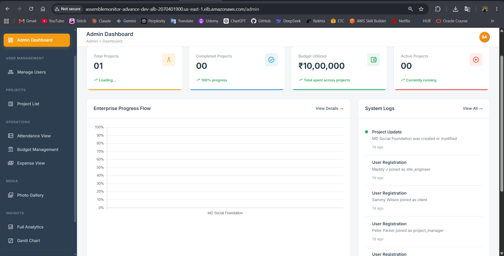
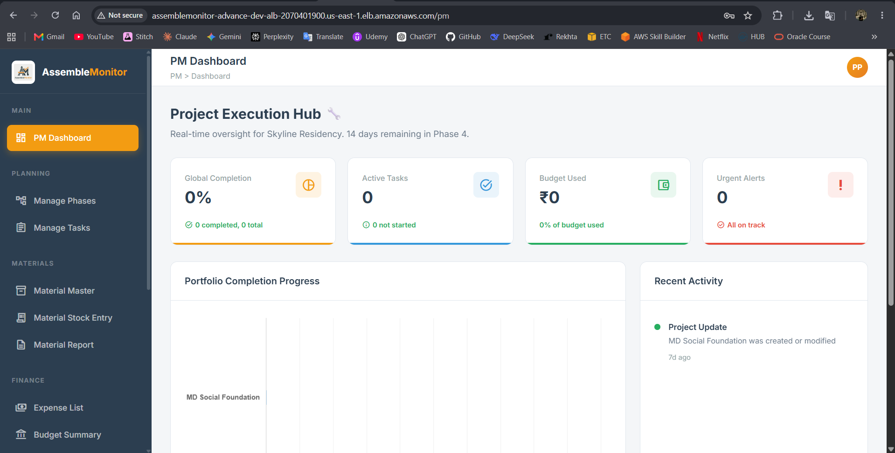
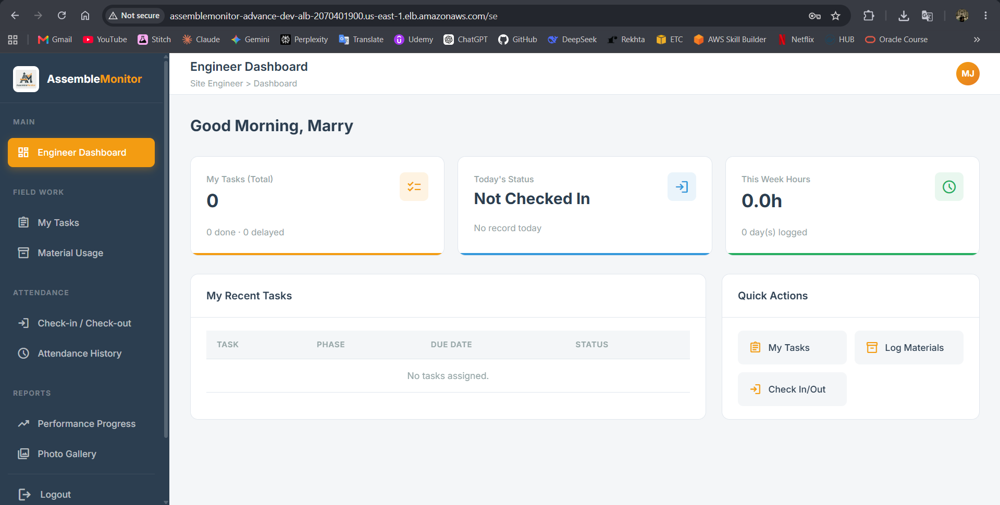
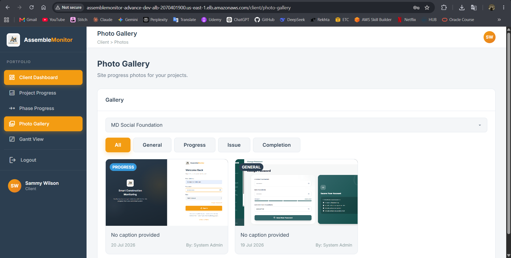
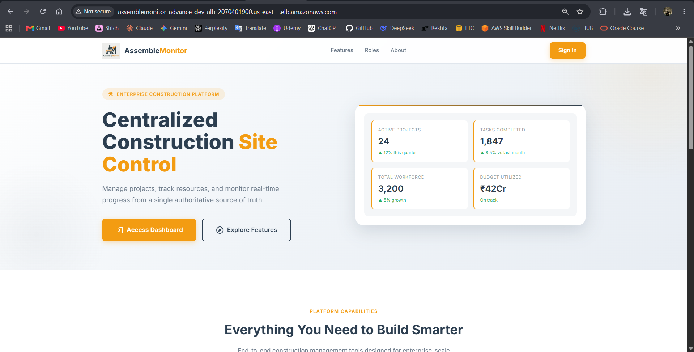
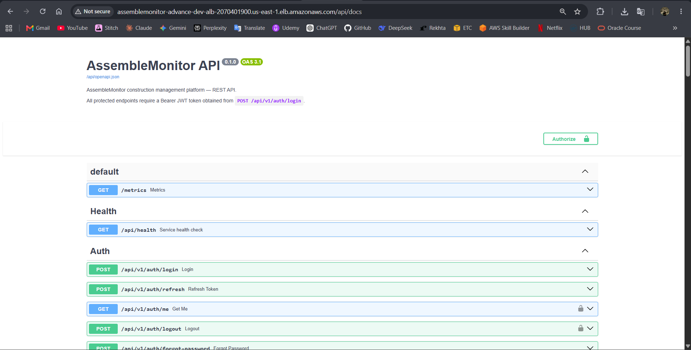

# AssembleMonitor: Application Overview

This document covers the application domain model, role model, status lifecycles, calculated fields, and analytics for AssembleMonitor.

For infrastructure and DevOps details, see [DEVOPS_IMPLEMENTATION.md](DEVOPS_IMPLEMENTATION.md).

---

## Domain Model

The application is organized around five primary entities: Project, Phase, Task, Material, and Expense. Supporting entities include User, Attendance, SitePhoto, and Notification.

```
Project
├── Phase (ordered by order_index)
│   ├── Task (assigned to a site engineer)
│   └── Expense (optionally linked to a phase)
├── Material
│   ├── MaterialStock  (received inventory records)
│   └── MaterialUsage  (consumption records, linked to phase or task)
├── Expense (project-level)
├── Attendance (one record per user per project per day)
└── SitePhoto (stored in Amazon S3)
```

| Entity | Table | Purpose |
|--------|-------|---------|
| `User` | `users` | Platform user with one of four roles |
| `Project` | `projects` | Top-level construction project with budget, dates, and status |
| `ProjectAssignment` | `project_assignments` | Links a user to a project with a designated role |
| `Phase` | `phases` | Ordered division of a project; status and progress are computed automatically |
| `Task` | `tasks` | Unit of work within a phase; assigned to a user |
| `Material` | `materials` | Material catalogue entry for a project |
| `MaterialStock` | `material_stock` | Stock receipt: quantity received, date, and supplier |
| `MaterialUsage` | `material_usage` | Consumption record: quantity used, phase and task reference |
| `Expense` | `expenses` | Financial expense linked to a project and optionally a phase |
| `Attendance` | `attendance` | Daily check-in and check-out record per user per project |
| `SitePhoto` | `site_photos` | Photo metadata; file stored in Amazon S3 |
| `Notification` | `notifications` | In-app notification per user |

All primary keys are UUIDs. All entities carry `created_at` and `updated_at` timestamps.

---

## Role Model

| Role | Scope |
|------|-------|
| `admin` | Unrestricted access to all resources across the platform |
| `project_manager` | Phase and task management, expense management, and material stock on assigned projects |
| `site_engineer` | Task status updates, attendance, material usage logging, and site photo uploads on assigned projects |
| `client` | Read-only access to project status, task progress, and budget analytics on assigned projects |

Users are linked to projects through `ProjectAssignment`. A user can be assigned to a project only once. Admins are never inserted into this table and access all resources unconditionally. The `ProjectAssignment.role` column accepts only `project_manager`, `site_engineer`, or `client`.

---

## Status Lifecycles

### Project status

Valid values: `planning`, `active`, `on_hold`, `completed`, `cancelled`

Recalculated automatically after every phase status change (`utils/logic.py`):
- 0% overall phase progress → `planning`
- 1%–99% → `active`
- 100% → `completed`

The values `on_hold` and `cancelled` exist as valid database values but are not set by any application logic.

### Phase status

Valid values: `not_started`, `in_progress`, `completed`, `on_hold`

Recalculated automatically after every task create, update, or delete. Phase status cannot be set manually; the update endpoint strips any `status` field before saving.

- No tasks, or all tasks `not_started` → `not_started`
- Any other mix → `in_progress`
- All tasks `completed` → `completed`

The value `on_hold` exists as a valid database value but is not set by the application.

### Task status

Valid values: `not_started`, `in_progress`, `completed`, `blocked`

Default on creation: `not_started`. When status changes to `in_progress` and `start_date` is not set, it is recorded automatically. When status changes to `completed`, `completed_date` is recorded automatically.

### Task priority

Valid values: `low`, `medium`, `high`, `critical` — default: `medium`

### Expense status

Valid values: `pending`, `approved`, `rejected`

Default on creation: `pending`. Updated by PM or Admin via `PATCH /expenses/{id}`. When set to `approved`, the `approved_by` field is recorded.

Expense categories: `Labour Payment`, `Equipment Rental`, `Transportation`, `Materials`, `Miscellaneous`, `Office Supplies`, `Site Utilities`

### Attendance status

Valid values: `present`, `absent`, `late`, `half_day`

Set to `present` on check-in. One record per user per project per day is enforced.

---

## Calculated Fields

### `progress_pct` — Project level

Source: `routers/analytics.py`

```python
progress_pct = (completed_tasks / total_tasks * 100) if total_tasks > 0 else 0.0
```

Counts all tasks across all phases. Returns `0.0` for projects with no tasks. Rounded to two decimal places.

### `progress_pct` — Phase level

Source: `utils/logic.py`

```python
progress_pct = (completed_tasks / total_tasks) * 100.0
```

Stored in `phases.progress_pct` and updated on every task status change.

### `is_delayed` — Task level

Source: `models/task.py`

```python
# Completed tasks
is_delayed = completed_date > due_date  # if both are set

# Incomplete tasks
is_delayed = date.today() > due_date    # if due_date is set
```

Tasks without a `due_date` are never flagged as delayed.

### `budget_used_pct` — Project level

Source: `routers/analytics.py`

```python
total_spent = sum(non_rejected_expenses) + sum(material.total_used * material.unit_cost)
budget_used_pct = (total_spent / budget * 100) if budget > 0 else 0.0
```

Expenses with status `rejected` are excluded. Returns `0.0` if no budget is set. Rounded to two decimal places.

### `is_low_stock` — Material level

Source: `models/material.py`

```python
remaining_stock = total_received - total_used
threshold = max(total_required_qty * 0.1, 5.0)
is_low_stock = remaining_stock < threshold
```

Returns `False` if `total_required_qty` is not set or is zero.

### `total_hours` — Attendance level

Source: `models/attendance.py`

```python
total_hours = (check_out - check_in).total_seconds() / 3600.0
```

Returns `0.0` if either `check_in` or `check_out` is missing.

---

## Analytics Endpoints

All endpoints are in `routers/analytics.py`. Non-admin users receive data only for projects they are assigned to.

| Endpoint | Access | Returns |
|----------|--------|---------|
| `GET /analytics/overview` | All roles | Per-project: `progress_pct`, task counts by status, delayed count, `budget_used_pct` |
| `GET /analytics/gantt` | All roles | All phases and tasks with dates, status, and `is_delayed` flag |
| `GET /analytics/budget` | PM, Admin, Client | Budget totals: expenses, material cost, total spent, remaining, `budget_used_pct` |
| `GET /analytics/materials` | All roles | Material type count, low-stock item count, total material cost |
| `GET /analytics/attendance-summary` | All roles | Total check-in count and total hours logged for the project |
| `GET /analytics/admin-overview` | Admin only | Platform totals: users, projects, active projects, total budget, total spend |
| `GET /analytics/recent-activity` | All roles | Time-sorted feed of task, material, and project events; Admin also sees user registrations |

---

## Role Dashboards

Each role is routed to a dedicated dashboard on login by `DashboardRoutePage.jsx`.

### Admin Dashboard



### Project Manager Dashboard



### Site Engineer Dashboard



### Client Dashboard



### Landing Page



---

## API Reference

All routes are served under the `/api/v1` prefix. A full OpenAPI specification is available at `/api/docs` when running locally.

Authentication uses JWT bearer tokens issued at `POST /api/v1/auth/login` with a JSON body containing `email` and `password`. The access token is sent as a `Bearer` header on all protected routes. A refresh token is issued alongside the access token and used at `POST /api/v1/auth/refresh`.



Evidence: `backend/app/routers/` · `backend/app/models/` · `backend/app/utils/logic.py`
