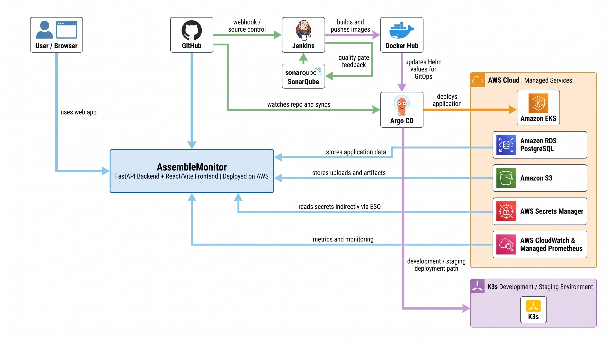
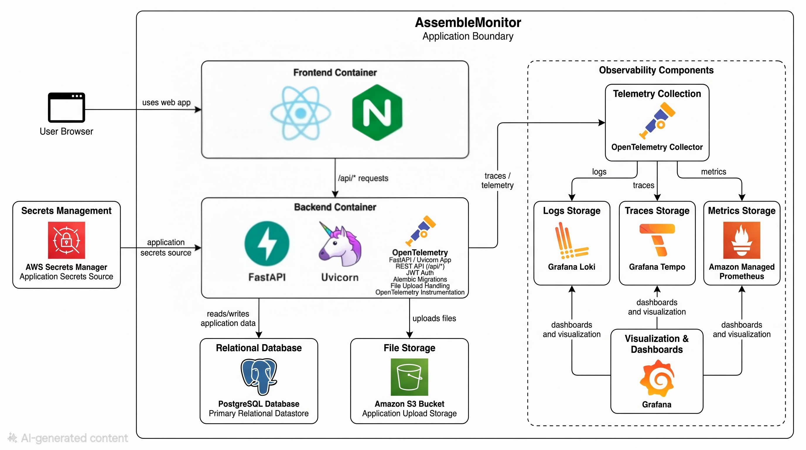
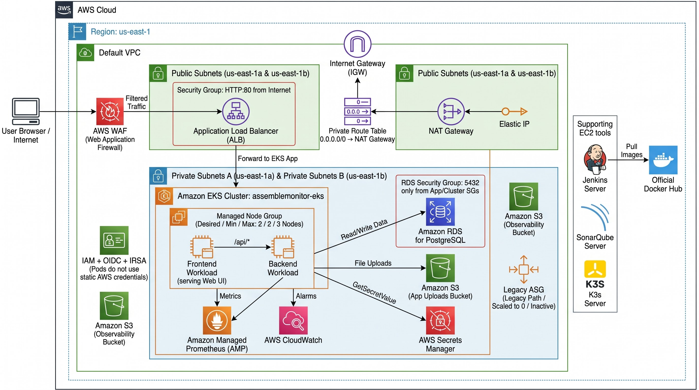
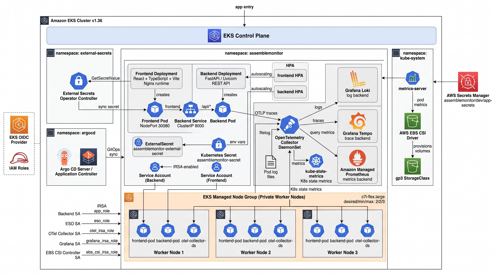
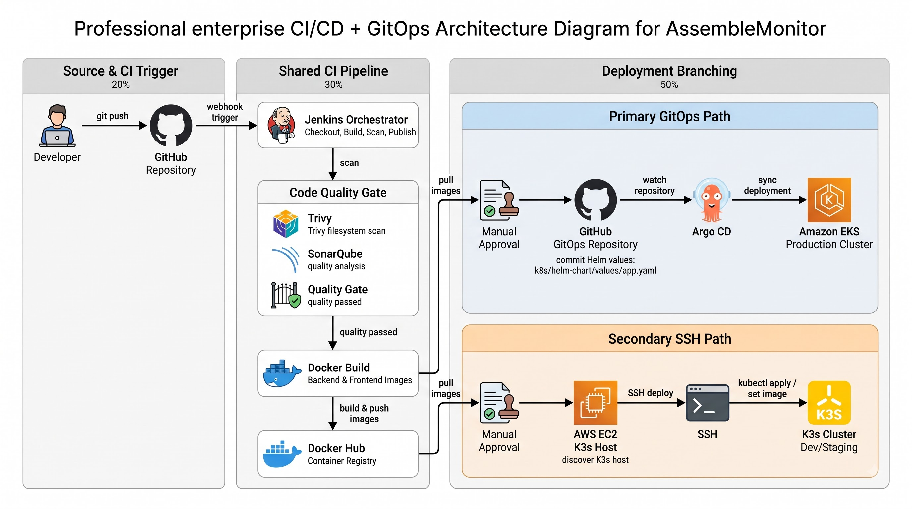
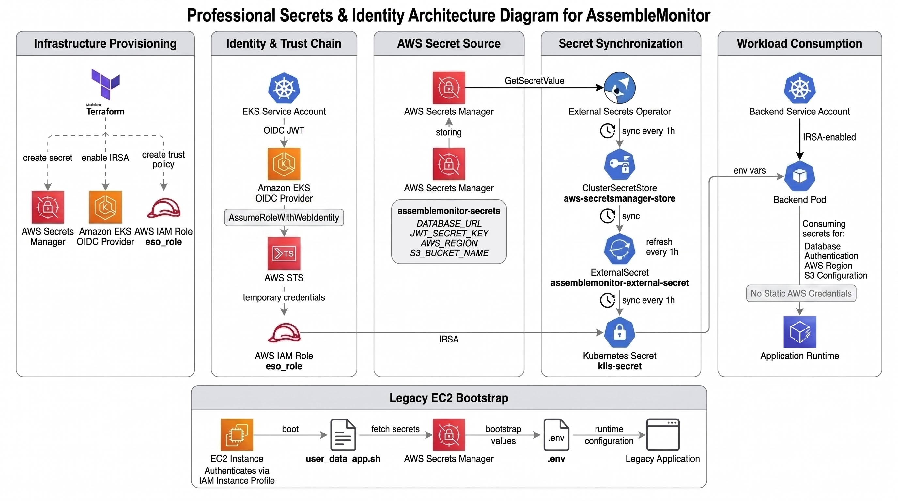
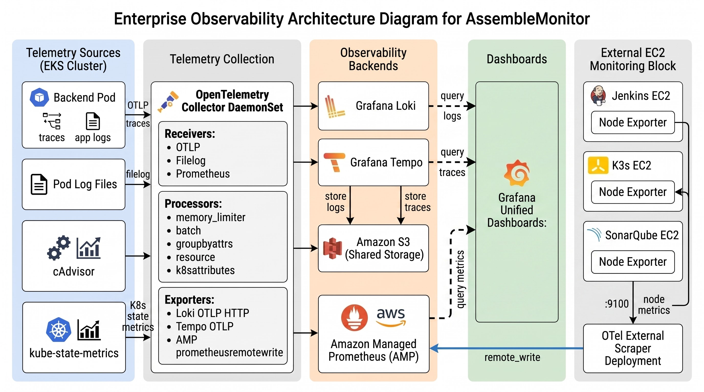
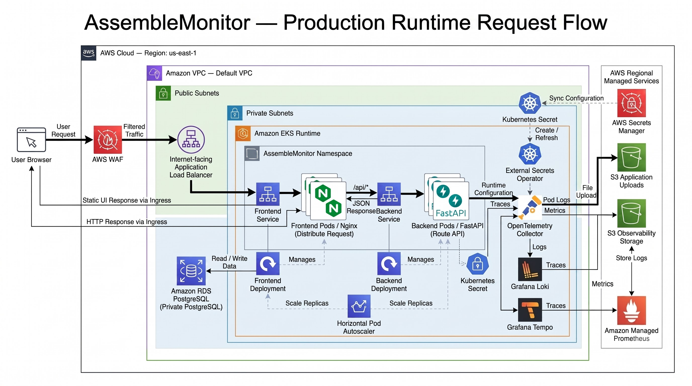
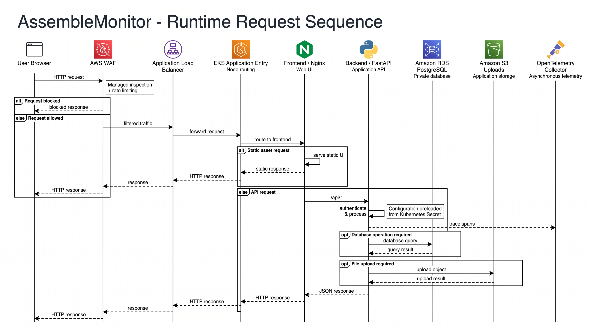
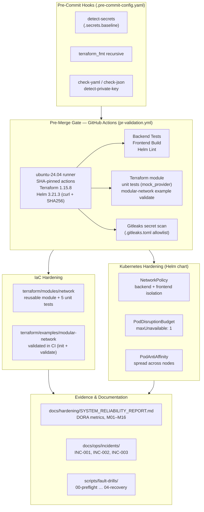

# AssembleMonitor Architecture

## Architectural Evolution

The architecture of AssembleMonitor has progressively evolved to handle increased scale, implement rolling Kubernetes deployments, and apply cloud-native security standards:

1. **Legacy Auto Scaling**: The initial cloud deployment ran raw Docker containers on EC2 instances managed by an AWS Auto Scaling Group (ASG), fetching credentials dynamically via IAM instance profiles.
2. **Staging Environment (K3s)**: We introduced a standalone Kubernetes (K3s) server to transition the workloads to container orchestration, enabling automated rolling updates via Jenkins CI/CD.
3. **Enterprise Production (Amazon EKS)**: The current architecture. We migrated the workloads to a managed Amazon EKS cluster with managed Node Groups (`c7i-flex.large`), integrating an AWS WAF-protected ALB directly into the Kubernetes NodePorts. This architecture implements GitOps (ArgoCD) for continuous deployment and IRSA for least-privilege security.

---

## Diagram 0 — Master High-Level Overview

> The single diagram that shows the entire AssembleMonitor system in one view. Four quadrants cover every layer of the platform: **A. Access & Delivery** — developer git push, GitHub webhook, Jenkins CI/CD pipeline (checkout → scan → quality gate → build → push → GitOps), Trivy, SonarQube, Docker Hub, ArgoCD, and the K3s secondary deploy path; **B. AWS Cloud (us-east-1)** — Default VPC with WAF-protected ALB, EKS cluster across two private subnets (A: 172.31.96.0/24, B: 172.31.97.0/24), all Kubernetes workloads (Frontend, Backend, OTel Collector DaemonSet, ESO, ArgoCD, Grafana, Loki, Tempo, HPA, Metrics Server, EBS CSI Driver), RDS PostgreSQL, NAT Gateway, and supporting EC2 instances (Jenkins, SonarQube, K3s) in default public subnets; **C. Secrets & IRSA** — full OIDC → IAM Roles → AWS Secrets Manager → ESO → ClusterSecretStore → ExternalSecret → Kubernetes Secret synchronisation chain; **D. Observability detailed flow** — OTel Collector receiving pod logs (filelog), backend OTLP traces, cAdvisor and kube-state-metrics, routing to Loki, Tempo, and Amazon Managed Prometheus, all queried by Grafana; plus the **Legacy path** (inactive EC2 ASG) for historical reference.

---

## Diagram 1 — System Context

> Shows the complete ecosystem surrounding AssembleMonitor: construction professionals (Admin, Project Manager, Site Engineer, and Client) interact through a browser; GitHub triggers CI/CD automation via Jenkins; Docker Hub serves as the container registry; AWS Cloud hosts the EKS production cluster and K3s staging environment; and AWS managed services (RDS, S3, Secrets Manager, CloudWatch) support the application backend.

---

## Diagram 2 — Application & Container Architecture

> Internal boundaries of the AssembleMonitor application: the Frontend container (React + TypeScript + Vite, served by Nginx) handles all static UI delivery; the Backend container (FastAPI + Uvicorn with OpenTelemetry instrumentation) exposes the REST API under `/api/*`; PostgreSQL on RDS is the primary relational datastore; S3 stores construction site photo uploads; AWS Secrets Manager is the secrets source injected via ESO; and three observability backends (Grafana Loki for logs, Grafana Tempo for traces, Amazon Managed Prometheus for metrics) receive telemetry from the OTel Collector.

---

## Diagram 3 — AWS Network & Infrastructure Deployment

> Full AWS VPC topology in `us-east-1`: Internet Gateway and NAT Gateway sit in public subnets; an Application Load Balancer protected by AWS WAF (Web Application Firewall) is the single public entry point; the EKS Managed Node Group (3 × `c7i-flex.large`) and RDS PostgreSQL are fully isolated in private subnets; two S3 buckets serve application file uploads and observability backend storage separately; IAM + OIDC + IRSA enforce least-privilege identity at the pod level; and supporting EC2 servers (Jenkins, SonarQube, K3s) operate as external actors. A Route 53 hosted zone and ACM certificate exist in `terraform/route53.tf` but are **not applied** — no custom domain is registered, and public access uses the ALB DNS name directly.

---

## Diagram 4 — EKS Internal Architecture

> Kubernetes cluster internals at full depth: the EKS Control Plane manages four namespaces — `assemblemonitor` (Frontend Deployment, Backend Deployment, both HPAs, OTel Collector DaemonSet, ExternalSecret, and two Kubernetes Secrets), `external-secrets` (ESO Controller with IRSA), `argocd` (ArgoCD Application Controller), and `kube-system` (Metrics Server, EBS CSI Driver, gp3 StorageClass). Five IRSA-enabled ServiceAccounts (Backend, ESO, OTel Collector, Grafana, EBS CSI Controller) map to dedicated IAM roles. The Managed Node Group runs 3 worker nodes with a desired/min/max of 2/2/3.

---

## Diagram 5 — CI/CD & GitOps Pipeline

> End-to-end delivery pipeline from source code to production: a developer pushes to GitHub, which triggers a Jenkins webhook; Jenkins runs the full CI pipeline — source checkout, Trivy filesystem security scan, SonarQube static code analysis with a quality gate, Docker image build, and Docker Hub publish. The pipeline then branches: the **Primary GitOps Path** commits updated Helm image tags to the repository, ArgoCD detects the change and performs a Kubernetes rolling deployment to the EKS production cluster; the **Secondary SSH Path** deploys directly to the K3s staging cluster via SSH and `kubectl apply` after manual approval.

---

## Diagram 6 — Secrets & Identity Management (IRSA + ESO)

> Complete zero-static-credentials secrets lifecycle across five stages: **Infrastructure Provisioning** — Terraform creates the OIDC Provider, IAM Roles, and the initial secret in AWS Secrets Manager; **Identity & Trust Chain** — EKS ServiceAccounts exchange OIDC JWT tokens for temporary AWS STS credentials via `AssumeRoleWithWebIdentity` (IRSA); **AWS Secret Source** — Secrets Manager stores `DATABASE_URL`, `JWT_SECRET_KEY`, `AWS_REGION`, and `S3_BUCKET_NAME` under the `assemblemonitor/dev/app-secrets` path; **Secret Synchronization** — the External Secrets Operator syncs secrets every hour through a `ClusterSecretStore` into a native Kubernetes Secret; **Workload Consumption** — the Backend Pod reads all configuration via environment variables, with no static AWS credentials present anywhere in Git or the container image. A Legacy EC2 Bootstrap path (user_data script fetching from Secrets Manager at boot) is also illustrated for historical reference.

---

## Diagram 7 — Observability Stack

> Full-stack telemetry pipeline covering all signals — logs, traces, and metrics: the Backend Pod emits OTLP traces and structured application logs; Pod log files are collected via a filelog receiver; cAdvisor provides container resource metrics; kube-state-metrics exposes Kubernetes object state metrics. All signals are ingested by the **OTel Collector DaemonSet**, which applies processors (memory limiter, batch, resource attributes, k8s attributes) and exports to Grafana Loki (logs), Grafana Tempo (traces), Amazon Managed Prometheus via remote_write (metrics), and Amazon S3 (shared long-term storage). Grafana provides a unified dashboard layer across all three backends. A dedicated **OTel External Scraper Deployment** pulls Node Exporter metrics from Jenkins, K3s, and SonarQube EC2 instances and forwards them to AMP.

---

## Diagram 8 — Production Runtime Request Flow

> Complete live-traffic path at runtime: a User Browser sends an HTTP request that hits **AWS WAF** for managed inspection and rate limiting; filtered traffic reaches the **Application Load Balancer**, which forwards to the **EKS NodePort**; the **Frontend Service** routes to Nginx pods, which either serve static UI assets directly or proxy `/api/*` requests to the **Backend Service**; **FastAPI** authenticates via JWT (configuration preloaded from a Kubernetes Secret injected by ESO), executes the database query against **Amazon RDS PostgreSQL**, and optionally uploads files to **Amazon S3** via IRSA-issued temporary credentials. The **OTel Collector** asynchronously ships pod logs, OTLP traces, and container metrics to the observability backends. The **Horizontal Pod Autoscaler** independently scales both Frontend and Backend Deployments (minimum 2, maximum 5 replicas) based on CPU utilization. The full HTTP response propagates back through every layer to the browser.

---

## Diagram 9 — Runtime Request Sequence

> Step-by-step HTTP interaction timeline showing every actor in sequence: the Browser sends an HTTP request to **AWS WAF**, which performs managed inspection and rate limiting — blocked requests receive an immediate response; allowed traffic is forwarded to the **Application Load Balancer**, which routes to the **EKS Application Entry** (NodePort); the request reaches **Frontend/Nginx**, which either serves a static asset directly (static asset branch) or proxies the path to **Backend/FastAPI** (API branch); FastAPI authenticates and processes the request, executes a database query on **Amazon RDS PostgreSQL**, optionally uploads an object to **Amazon S3**, and asynchronously exports trace spans to the **OpenTelemetry Collector**. The JSON response propagates back through each layer to the browser.

---

## Component Explanation

### Amazon EKS (Elastic Kubernetes Service)

The core production environment running the application natively via Kubernetes pods. Nodes are provisioned dynamically in an EKS Managed Node Group within private subnets. Traffic is managed by a Terraform-owned AWS Application Load Balancer (ALB) bound directly to the EKS NodePorts, and protected by an AWS Web Application Firewall (WAF).

### GitOps & Auto-Scaling

- **ArgoCD**: The GitOps Continuous Delivery controller. It constantly monitors the GitHub repository and ensures the EKS cluster state perfectly matches the Helm templates stored in Git.
- **Horizontal Pod Autoscaler (HPA)**: Dynamically scales the frontend and backend pods (from 2 up to 5) based on CPU utilization metrics collected by the Kubernetes Metrics Server.

### Security (IRSA & ESO)

- **Metadata Security**: The EC2 instance metadata endpoint hop limit is restricted (`hop_limit = 1`) to prevent containers from assuming the node's IAM role.
- **IRSA (IAM Roles for Service Accounts)**: A secure, OIDC-backed AWS token is injected directly into the Backend pod, granting it precise permissions to interact with AWS S3 via `boto3`.
- **External Secrets Operator (ESO)**: Also leveraging IRSA, this operator dynamically fetches database credentials and JWT secrets from AWS Secrets Manager and safely mounts them as native Kubernetes Secrets, preventing hardcoded Base64 credentials.

### Frontend & Backend

- **Frontend**: React and Vite, containerized and served using Nginx inside the frontend Kubernetes Pods. The Nginx reverse-proxy configuration is dynamically injected at runtime via Kubernetes ConfigMaps.
- **Backend API**: Python FastAPI exposing REST APIs. Environment variables are injected securely via Kubernetes Secrets pulled by ESO.

### Database & Storage

- **AWS RDS PostgreSQL**: Managed database deployed securely within private subnets.
- **AWS S3**: Secure object storage for construction site photos.

### Infrastructure as Code

Terraform is utilized extensively to codify the VPC, ALB, WAF, RDS, S3, Secrets Manager, IAM Roles (including OIDC Trust Policies), and the EKS Cluster. A Route 53 hosted zone and ACM certificate configuration is written and plan-validated (`terraform/route53.tf`) but not applied — the project currently uses the ALB DNS name for public access.

---

## 10 — August 2026 Post-Deployment Hardening

> This section documents the reliability and security hardening applied to the repository in August 2026, after the primary EKS deployment was complete. Changes are evidenced in [`docs/hardening/SYSTEM_RELIABILITY_REPORT.md`](../hardening/SYSTEM_RELIABILITY_REPORT.md).

