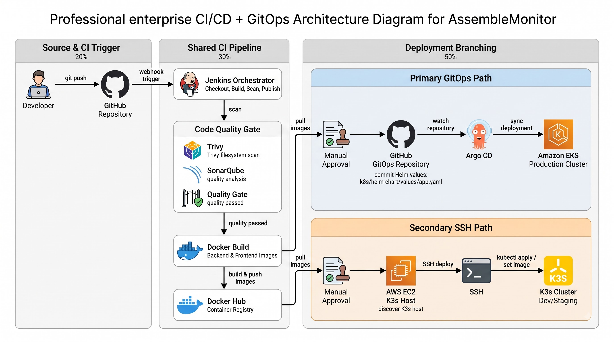

# DevSecOps GitOps Pipeline

## Responsibility Boundary

```
GitHub Actions    =  fast pre-merge validation (no Jenkins infrastructure needed)
Jenkins           =  deep CI + image/security/release preparation
GitHub repository =  desired Kubernetes cluster state (single source of truth)
Argo CD           =  continuous delivery / reconciliation into EKS
EKS               =  runtime / orchestration
```

> **Critical distinction:** A successful Jenkins build does not mean Jenkins deployed the application to EKS. In the primary GitOps path, Jenkins commits the updated image tag to `k8s/helm-chart/values/app.yaml` in Git. Argo CD detects that commit and reconciles the resulting desired state into EKS. The cluster's state is always a Git commit, not a pipeline execution.

---

## Pipeline Purpose

The Jenkins pipeline (`Jenkinsfile-gitops`) automates the build, security auditing, and release of the AssembleMonitor application. Jenkins operates strictly as the CI engine and GitOps handoff trigger. It does not apply Kubernetes manifests.

Argo CD, running as the CD controller inside the EKS cluster, continuously reconciles the cluster state against the GitHub repository.

## Infrastructure Components

- **Jenkins Server**: Orchestrates the CI pipeline. Executes Trivy, manages the SonarQube integration, and performs the Git commit that triggers Argo CD.
- **SonarQube Server**: SAST via SonarQube v10 (Community Edition).
- **GitHub Repository**: Declarative source of truth for the Kubernetes cluster state, hosting `k8s/helm-chart/`.
- **Argo CD (EKS in-cluster)**: GitOps controller that continuously reconciles EKS against the GitHub repository.

## Pipeline Execution Stages

1. **Checkout** — Retrieves application source code.
2. **Show Build Info** — Outputs image tags, branch, and workspace context.
3. **Docker Check** — Validates Docker availability on the Jenkins node.
4. **Trivy FS Scan (Backend)** — Scans backend source for HIGH/CRITICAL CVEs.
5. **SonarQube Analysis (Backend)** — SAST: security hotspots, code smells, bugs.
6. **Trivy FS Scan (Frontend)** — Scans frontend source for HIGH/CRITICAL CVEs.
7. **SonarQube Analysis (Frontend)** — SAST for frontend.
8. **Quality Gate** — Halts pipeline if SonarQube gate fails (5-minute timeout).
9. **Backend Build Validation** — Dry-run `python -m compileall app` inside the container.
10. **Frontend Build Validation** — Validates the Vite build configuration.
11. **Build Final Images** — Produces `${BUILD_NUMBER}` and `latest` tags for both images.
12. **Trivy Image Scan (Backend)** — Container image scan, HIGH/CRITICAL, `--exit-code 1`.
13. **Trivy Image Scan (Frontend)** — Container image scan, HIGH/CRITICAL, `--exit-code 1`.
14. **Docker Hub Login** — Authenticates via Jenkins credential binding.
15. **Push Images** — Pushes both images to Docker Hub.
16. **Approve EKS GitOps Deploy** — Manual gate (10-minute timeout).
17. **GitOps: Update Helm Values** — `sed` patches the image tag in `k8s/helm-chart/values/app.yaml`; commits and pushes to GitHub via PAT. This commit triggers Argo CD reconciliation.

## Access Credentials

| Credential ID | Purpose |
|---|---|
| `dockerhub-creds` | Registry authentication for image publication |
| `github-creds` | PAT for programmatic repository commits (GitOps handoff) |
| `SonarQubeServer` | Jenkins global config token for SonarQube API |

## Deployment Flow



> Jenkins CI pipeline: Trivy FS scan → SonarQube SAST → Quality Gate → Docker build → Trivy image scan → Docker Hub push. GitOps handoff: Jenkins commits the new image tag → Argo CD detects the Git change → rolling deployment on EKS. The K3s path uses direct `kubectl apply` via SSH after manual approval.

---

## Pre-Merge Validation (GitHub Actions)

Five jobs run in parallel on every pull request targeting `main`. They provide rapid, stateless verification without requiring the persistent Jenkins infrastructure:

| Job | What it checks |
|---|---|
| **backend-test** | `pytest` suite (23 tests), Python compileall |
| **frontend-build** | `npm ci` + Vite production build |
| **terraform-validate** | `fmt -check`, `init`, `validate`, `terraform test` on network module |
| **helm-validate** | Dependency build, `helm lint`, template render |
| **secret-scan** | Gitleaks v3 full-history scan (SHA-pinned) |

All five are enforced as required status checks by the `main-protection` branch ruleset.

---

## Implementation Notes

- Implemented source checkout, build-info, and Docker validation stages.
- Integrated Trivy filesystem scanning for both backend and frontend before any image is built.
- Integrated SonarQube SAST for both components and enforced the quality gate: the pipeline aborts if the gate fails.
- Implemented Docker multi-stage builds and Trivy image scanning with `--exit-code 1` to block vulnerable images from reaching the registry.
- Added a manual approval gate before the GitOps commit so no production change is automatic.
- Implemented the GitOps handoff: `sed` updates the image tag in `k8s/helm-chart/values/app.yaml`, commits with `[skip ci]`, and pushes via a Jenkins-managed PAT. This commit is what Argo CD detects.
- Configured the Jenkins credential store for Docker Hub, GitHub PAT, and SonarQube token; no credentials are hardcoded in the pipeline.

Evidence: `Jenkinsfile-gitops`
